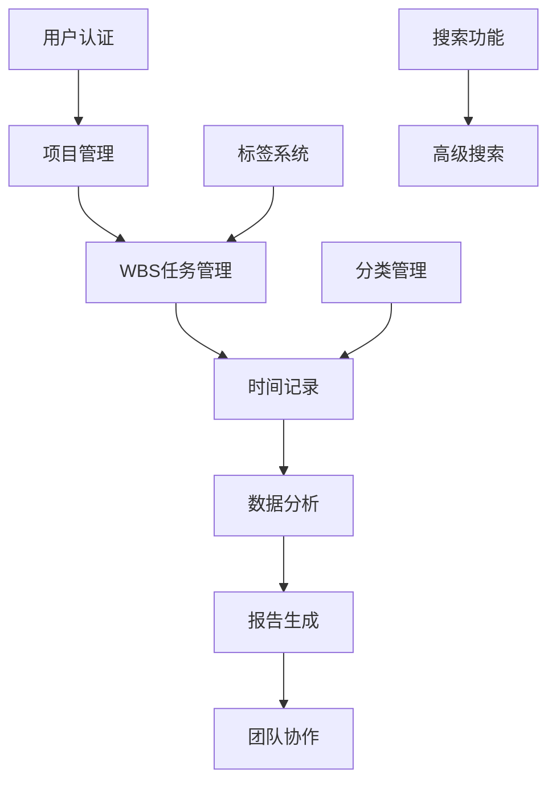
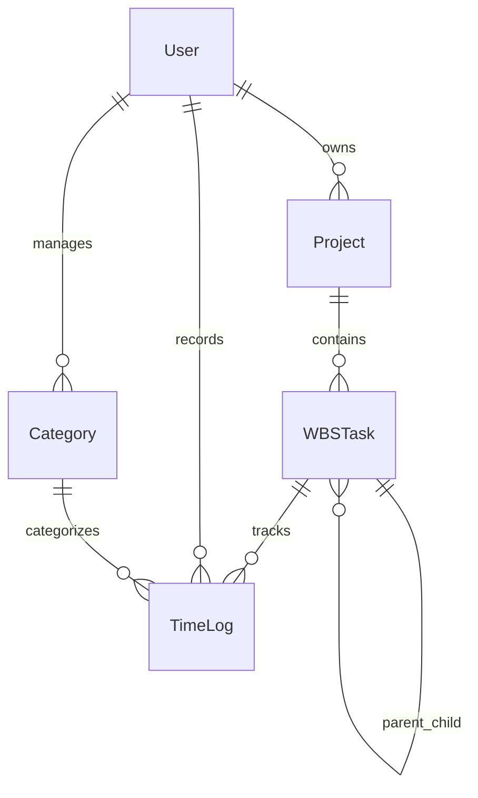
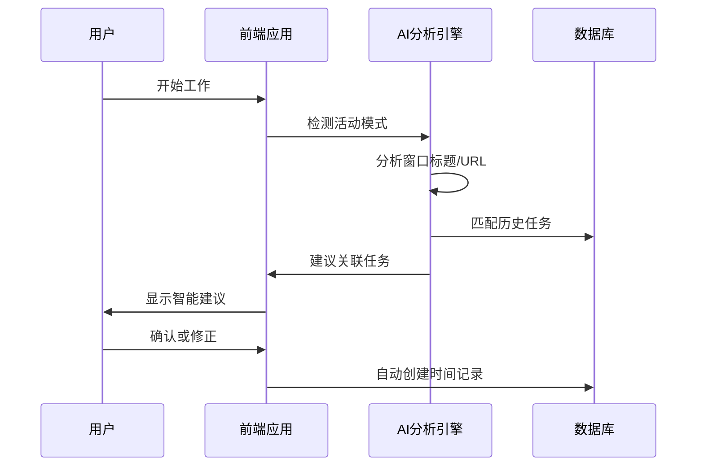
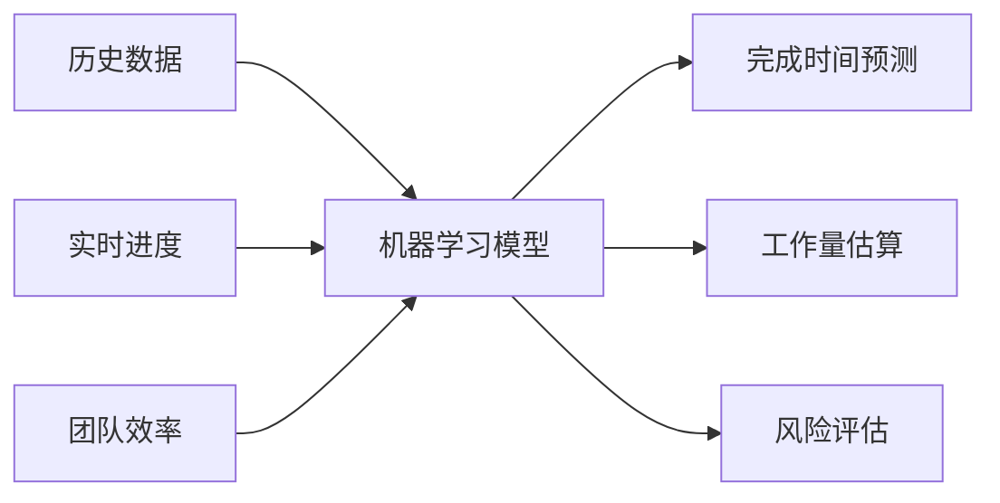
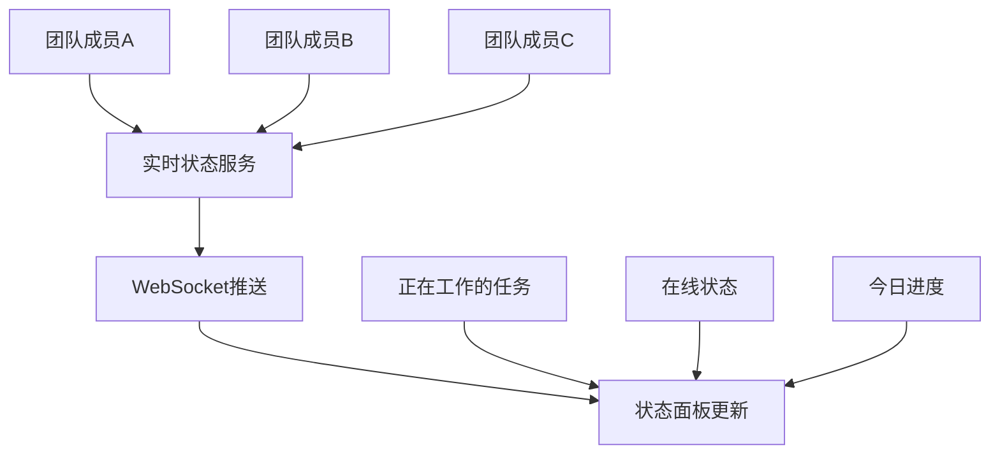
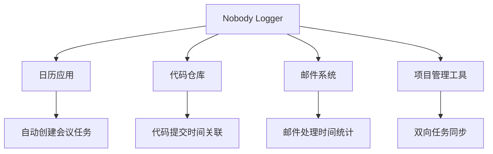
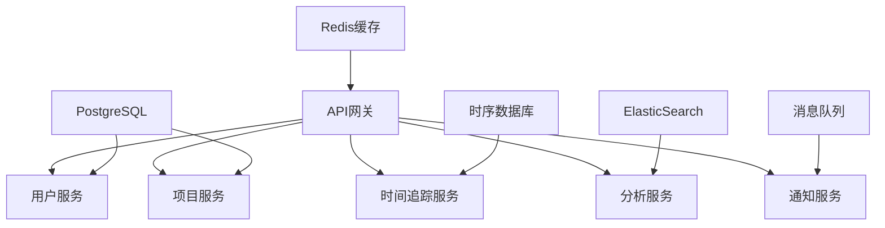
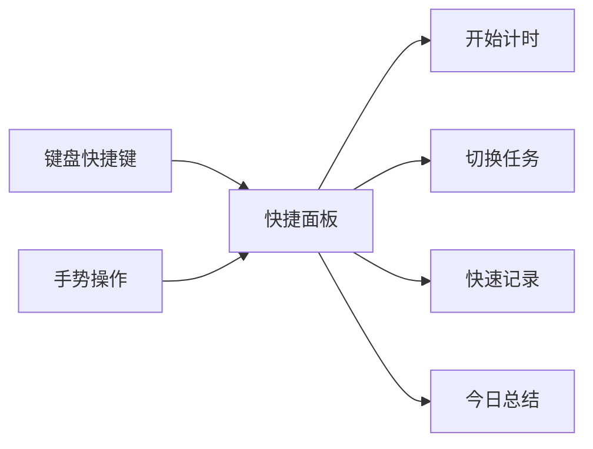
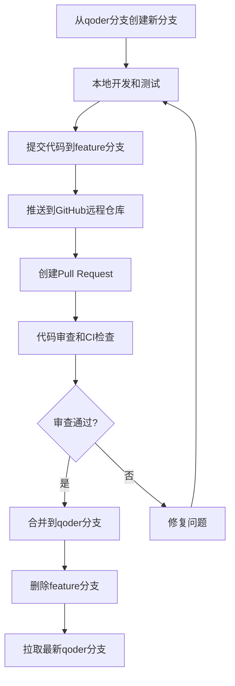
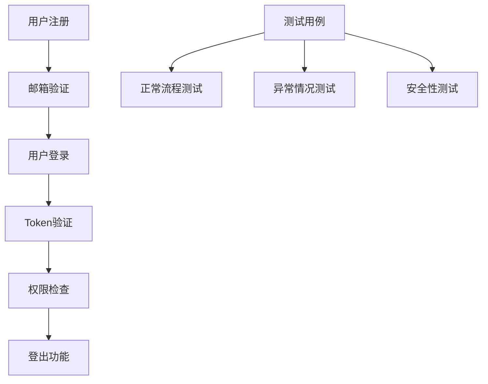

# Nobody Logger 系统优化设计分析

## 1. 系统现状分析

### 1.1 技术架构概览
基于claude-code分支的分析，系统采用Next.js 14全栈架构：
- **前端**: React 18 + TypeScript + Tailwind CSS + Ant Design
- **后端**: Next.js API Routes + JWT认证
- **数据库**: SQLite + better-sqlite3
- **部署**: 单体应用架构

### 1.2 核心功能模块
系统已实现的核心功能包括：



### 1.3 数据模型架构



## 2. 性能瓶颈识别

### 2.1 数据库层面
- **问题**: SQLite单文件数据库在高并发场景下性能限制
- **影响**: 多用户同时操作时可能出现锁等待
- **现状**: 当前配置已优化（WAL模式、缓存设置）

### 2.2 前端渲染
- **问题**: 大型WBS树形结构渲染性能
- **影响**: 任务层级过深时UI响应延迟
- **现状**: 基础树形展示，缺乏虚拟滚动

### 2.3 API响应时间
- **问题**: 复杂统计查询缺乏缓存机制
- **影响**: 数据分析页面加载缓慢
- **现状**: 实时计算所有统计数据

## 3. 功能优化建议

### 3.1 智能时间追踪增强

#### 3.1.1 自动时间记录
**目标**: 减少手动输入，提高记录准确性

**设计方案**:


**实现要点**:
- 浏览器活动检测API
- 应用窗口标题监控
- 机器学习模式识别
- 智能任务匹配算法

#### 3.1.2 番茄工作法集成
**功能描述**: 内置番茄钟，结合专注模式

**核心特性**:
- 25分钟工作周期自动计时
- 5分钟休息提醒
- 专注模式期间禁用通知
- 番茄数量统计和趋势分析

### 3.2 高级数据分析系统

#### 3.2.1 预测性分析
**目标**: 基于历史数据预测项目完成时间



**算法设计**:
- 线性回归预测剩余工时
- 基于相似项目的类比估算
- 考虑个人效率波动的动态调整
- 项目风险因子评估

#### 3.2.2 个人效率洞察
**功能亮点**:
- 最佳工作时段识别
- 任务类型效率对比
- 打断频率和影响分析
- 工作负荷合理性评估

### 3.3 协作功能强化

#### 3.2.1 实时协作面板
**设计目标**: 团队成员实时状态同步



**技术实现**:
- WebSocket实时通信
- Redis状态缓存
- 在线状态心跳检测
- 任务进度实时同步

#### 3.2.2 智能任务分配
**核心逻辑**:
- 基于历史效率的任务匹配
- 工作负荷均衡算法
- 技能标签自动匹配
- 截止日期优先级排序

### 3.4 移动端优化

#### 3.4.1 PWA功能增强
**目标**: 提供原生应用体验

**功能清单**:
- 离线时间记录同步
- 推送通知提醒
- 快速任务切换
- 语音记录转文字

#### 3.4.2 移动端专用界面
**设计原则**:
- 单手操作友好
- 快速操作模式
- 简化的数据展示
- 手势导航支持

### 3.5 系统集成能力

#### 3.5.1 第三方应用集成
**集成目标**:



**技术方案**:
- OAuth2.0 统一认证
- Webhook 事件监听
- REST API 标准接口
- 插件系统架构

#### 3.5.2 API 生态系统
**设计特点**:
- GraphQL 查询接口
- 实时订阅机制
- 批量操作支持
- 版本控制策略

## 4. 架构升级方案

### 4.1 微服务拆分建议



**服务拆分原则**:
- 按业务领域划分
- 数据库分离
- 独立部署能力
- 横向扩展支持

### 4.2 缓存策略优化

**多层缓存架构**:
- **Redis**: 会话状态、实时数据
- **浏览器缓存**: 静态资源、用户配置
- **CDN**: 图片、脚本文件
- **应用缓存**: 计算结果、聚合数据

### 4.3 数据库升级路径

**阶段性迁移**:
1. **Phase 1**: SQLite → PostgreSQL (保持单体)
2. **Phase 2**: 读写分离 + 主从复制
3. **Phase 3**: 分库分表 + 时序数据库

## 5. 用户体验优化

### 5.1 界面交互改进

#### 5.1.1 快捷操作面板
**设计理念**: 一键完成常用操作



#### 5.1.2 智能提示系统
**功能特性**:
- 任务创建时的模板建议
- 时间记录的历史复用
- 项目状态异常提醒
- 效率下降预警

### 5.2 个性化定制

#### 5.2.1 主题系统
**定制选项**:
- 深色/浅色主题切换
- 色彩系统自定义
- 布局密度调节
- 字体大小适配

#### 5.2.2 工作流定制
**配置能力**:
- 自定义任务状态流转
- 个人工作节奏设置
- 通知策略配置
- 报告模板定制

## 6. 技术债务处理

### 6.1 代码质量提升
- **单元测试覆盖率**: 目标80%以上
- **端到端测试**: 核心流程自动化
- **代码审查流程**: 标准化checklist
- **性能监控**: 关键指标实时追踪

### 6.2 安全性加固
- **数据加密**: 敏感信息端到端加密
- **访问控制**: 细粒度权限管理
- **审计日志**: 完整操作轨迹记录
- **漏洞扫描**: 定期安全评估

## 7. 版本控制和分支管理策略

### 7.1 Git工作流程设计

#### 7.1.1 分支架构
```mermaid
gitgraph
    commit id: "claude-code (current)"
    branch qoder
    checkout qoder
    commit id: "创建qoder主分支"
    
    branch feature/testing-framework
    checkout feature/testing-framework
    commit id: "设置测试框架"
    commit id: "功能测试用例"
    checkout qoder
    merge feature/testing-framework
    
    branch bugfix/auth-token-issue
    checkout bugfix/auth-token-issue
    commit id: "修复认证问题"
    checkout qoder
    merge bugfix/auth-token-issue
    
    branch feature/smart-time-tracking
    checkout feature/smart-time-tracking
    commit id: "智能时间追踪基础"
    commit id: "自动记录功能"
    checkout qoder
    merge feature/smart-time-tracking
```

#### 7.1.2 分支命名规范
- **主分支**: `qoder` - 所有验证和优化工作的主分支
- **功能分支**: `feature/功能名称` - 新功能开发
- **修复分支**: `bugfix/问题描述` - Bug修复
- **测试分支**: `test/测试类型` - 测试相关工作
- **优化分支**: `optimize/优化内容` - 性能和体验优化

**示例**:
- `feature/smart-time-tracking` - 智能时间追踪功能
- `bugfix/wbs-tree-rendering` - WBS树渲染问题修复
- `test/comprehensive-function-test` - 全面功能测试
- `optimize/database-performance` - 数据库性能优化

### 7.2 GitHub Flow实施细则

#### 7.2.1 工作流程步骤



#### 7.2.2 详细操作流程

**第一步：分支创建**
```bash
# 切换到qoder分支并拉取最新代码
git checkout qoder
git pull origin qoder

# 创建新的功能分支
git checkout -b feature/comprehensive-testing
```

**第二步：开发和提交**
```bash
# 开发完成后暂存更改
git add .

# 提交更改（使用规范的提交信息）
git commit -m "feat: 添加系统全面功能测试框架

- 实现用户认证系统测试
- 添加项目管理功能测试用例
- 配置自动化测试流程

Resolves: #123"
```

**第三步：推送和PR**
```bash
# 推送分支到远程仓库
git push origin feature/comprehensive-testing

# 在GitHub上创建Pull Request
# PR标题: feat: 系统全面功能测试框架
# PR描述: 详细说明测试内容和验证结果
```

#### 7.2.3 提交信息规范

**格式**: `type(scope): description`

**类型(type)**:
- `feat`: 新功能
- `fix`: Bug修复
- `test`: 测试相关
- `refactor`: 代码重构
- `perf`: 性能优化
- `docs`: 文档更新
- `style`: 代码格式化

**示例**:
```
feat(auth): 实现智能时间追踪功能

- 添加自动活动检测
- 实现任务智能匹配
- 集成番茄工作法计时器

Testing: 单元测试覆盖率95%
Resolves: #456
```

### 7.3 分支生命周期管理

#### 7.3.1 分支状态管理

| 分支状态 | 描述 | 操作 |
|---------|------|------|
| 🚧 开发中 | 功能正在开发 | 定期提交，推送到远程 |
| 🔍 待审查 | 已创建PR，等待审查 | 响应审查意见，修复问题 |
| ✅ 已合并 | 合并到qoder分支 | 删除本地和远程分支 |
| ❌ 已废弃 | 不再需要的分支 | 删除本地和远程分支 |

#### 7.3.2 分支清理策略

```bash
# 合并后清理本地分支
git branch -d feature/comprehensive-testing

# 清理远程分支引用
git remote prune origin

# 删除远程分支（如果需要）
git push origin --delete feature/comprehensive-testing
```

### 7.4 代码审查标准

#### 7.4.1 PR审查检查清单

**功能性检查**:
- [ ] 功能实现符合需求
- [ ] 代码逻辑正确
- [ ] 错误处理完整
- [ ] 性能影响可接受

**代码质量检查**:
- [ ] 代码风格符合项目规范
- [ ] 变量和函数命名清晰
- [ ] 代码复用性良好
- [ ] 注释和文档完整

**测试覆盖检查**:
- [ ] 单元测试覆盖新功能
- [ ] 集成测试通过
- [ ] 手动测试验证
- [ ] 边界条件测试

#### 7.4.2 自动化检查集成

**GitHub Actions配置**:
```yaml
name: Code Review Checks
on:
  pull_request:
    branches: [ qoder ]

jobs:
  test:
    runs-on: ubuntu-latest
    steps:
    - uses: actions/checkout@v3
    - name: Setup Node.js
      uses: actions/setup-node@v3
      with:
        node-version: '18'
    - name: Install dependencies
      run: npm ci
    - name: Run tests
      run: npm run test:ci
    - name: Run linting
      run: npm run lint
    - name: Build check
      run: npm run build
```

## 8. 系统测试验证计划

### 7.1 测试验证目标
在执行任何优化工作之前，需要对系统进行全面测试，确保：
- 验证所有已实现功能的实际运行状态
- 识别现有功能中的潜在问题和bug
- 评估系统的性能基线
- 确认用户体验的真实情况

### 7.2 功能测试矩阵

#### 7.2.1 用户认证系统测试


**测试检查项**:
- [ ] 用户注册功能完整性
- [ ] 登录/登出流程正确性
- [ ] JWT Token生成和验证
- [ ] 密码加密存储验证
- [ ] 会话超时处理
- [ ] 异常错误处理

#### 7.2.2 项目管理功能测试
**核心功能验证**:
- [ ] 项目创建、编辑、删除
- [ ] 项目列表展示和筛选
- [ ] 项目状态管理
- [ ] 项目颜色和描述设置
- [ ] 数据持久化验证

#### 7.2.3 WBS任务管理测试
**层级结构验证**:
- [ ] 多层级任务创建
- [ ] 父子关系正确性
- [ ] 任务状态流转
- [ ] 任务优先级设置
- [ ] 进度百分比计算
- [ ] 树形展示交互

#### 7.2.4 时间记录功能测试
**时间追踪验证**:
- [ ] 手动时间记录创建
- [ ] 时间记录编辑和删除
- [ ] 计时器功能(如果已实现)
- [ ] 时间统计计算准确性
- [ ] 日期范围筛选
- [ ] 任务关联验证

#### 7.2.5 数据分析功能测试
**分析组件验证**:
- [ ] 仪表板数据加载
- [ ] 图表渲染正确性
- [ ] 时间分布分析
- [ ] 效率统计计算
- [ ] 数据过滤功能
- [ ] 响应式布局适配

#### 7.2.6 分类和标签系统测试
**数据组织验证**:
- [ ] 分类创建和管理
- [ ] 标签系统功能
- [ ] 分类颜色设置
- [ ] 任务关联分类
- [ ] 统计数据按分类展示

### 7.3 性能基线测试

#### 7.3.1 加载性能测试
**测试指标**:
- 首页加载时间 < 2秒
- 仪表板数据加载 < 3秒
- 大型任务树渲染 < 5秒
- API响应时间 < 500ms

#### 7.3.2 数据量压力测试
**测试场景**:
- 创建100个项目的系统响应
- 1000个任务的WBS树展示
- 10000条时间记录的统计计算
- 大量数据的搜索性能

### 7.4 用户体验测试

#### 7.4.1 界面交互测试
- [ ] 移动端响应式布局
- [ ] 操作反馈及时性
- [ ] 错误信息展示友好性
- [ ] 加载状态指示清晰性

#### 7.4.2 工作流完整性测试
**端到端场景**:
1. 新用户注册 → 创建项目 → 添加任务 → 记录时间 → 查看统计
2. 项目管理 → WBS规划 → 任务执行 → 进度跟踪 → 报告生成
3. 团队协作 → 权限管理 → 数据共享 → 协作编辑

### 7.5 兼容性测试

#### 7.5.1 浏览器兼容性
- [ ] Chrome (最新版本)
- [ ] Firefox (最新版本) 
- [ ] Safari (最新版本)
- [ ] Edge (最新版本)
- [ ] 移动端浏览器

#### 7.5.2 设备适配测试
- [ ] 桌面端 (1920x1080, 1366x768)
- [ ] 平板端 (768x1024)
- [ ] 手机端 (375x667, 414x896)

### 7.6 测试执行计划

#### 阶段一：核心功能验证 (第1-2周)
- 手动功能测试
- 基础性能测试
- 明显bug修复

#### 阶段二：深度测试 (第3周)
- 压力测试和边界测试
- 用户体验评估
- 性能瓶颈识别

#### 阶段三：测试报告 (第4周)
- 测试结果汇总
- 问题优先级评估
- 优化建议更新

### 7.7 测试完成标准

**通过标准**:
- 所有P0级别功能正常运行
- 无阻塞性bug存在
- 性能指标达到基线要求
- 用户核心工作流完整可用

**测试产出**:
- 功能测试报告
- 性能基线报告
- Bug清单和修复建议
- 用户体验问题列表

## 9. 执行进度记录

### 9.1 第一阶段：分支创建和环境准备

#### 9.1.1 Git分支创建
- [ ] 创建qoder主分支从claude-code分支
- [ ] 验证项目构建和运行
- [ ] 设置开发环境

#### 9.1.2 测试环境配置
- [ ] 检查现有测试配置
- [ ] 验证数据库连接
- [ ] 确认API端点可访问性

### 9.2 系统功能验证计划

**当前状态**: 🚀 开始执行
**开始时间**: 2024年实际执行时间
**预计完成**: 第1-4周

#### 执行步骤
1. **环境验证** (进行中) - 验证开发环境和依赖
2. **核心功能测试** (待开始) - 用户认证、项目管理等
3. **性能基线测试** (待开始) - 建立性能基准
4. **问题修复** (按需) - 修复发现的问题

## 10. 优化实施路线图

### 8.1 前置条件
- ✅ 完成系统全面测试验证
- ✅ 修复所有P0级别问题
- ✅ 建立性能监控基线
- ✅ 确认用户反馈和需求

### 8.2 实施优先级建议

#### 高优先级 (P0) - 测试验证后立即执行
1. **系统稳定性修复** - 解决测试中发现的关键问题
2. **性能优化** - 针对性能瓶颈进行优化
3. **用户体验修复** - 解决明显的UX问题

#### 中优先级 (P1) - 稳定性确保后执行
1. **智能时间追踪** - 解决核心痛点
2. **移动端PWA** - 扩大使用场景
3. **协作功能强化** - 团队使用价值

#### 低优先级 (P2) - 长期规划
1. **预测性分析** - 数据价值挖掘
2. **第三方集成** - 生态系统建设
3. **微服务改造** - 长期架构演进