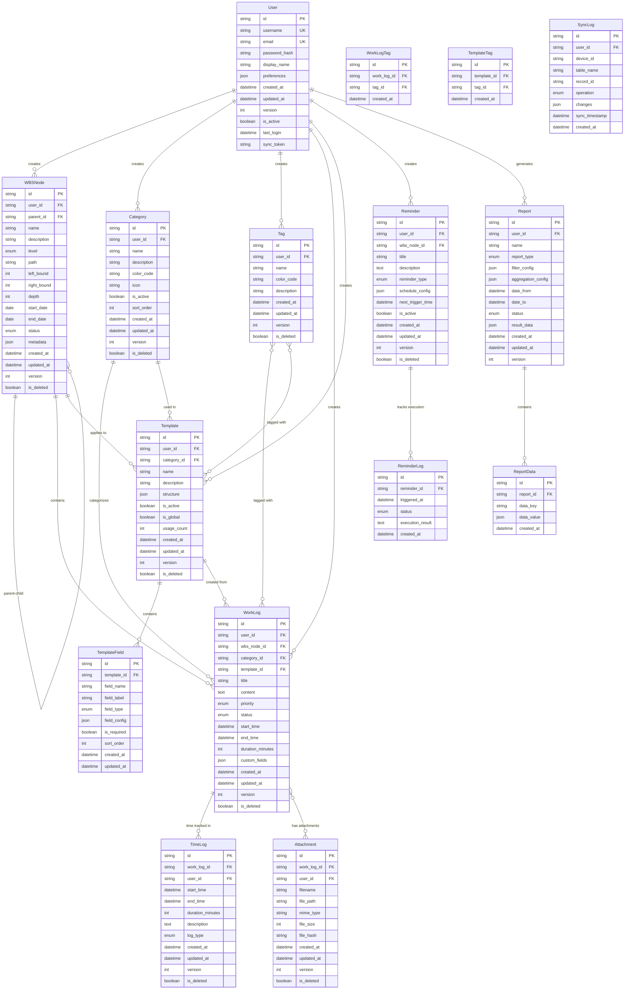

# 日志记录系统数据库设计文档

## 1. 概述

本文档定义了一个完整的SQLite数据库结构，用于支持多层级WBS工作日志记录系统。系统支持年→半年→季度→月→周→日的层级结构，包含工作分类、时间记录、报告生成、模板系统和跨设备同步功能。

## 2. 核心设计原则

- **层级结构优化**: 使用嵌套集合模型和路径枚举混合方案优化WBS查询性能
- **数据同步支持**: 每个表包含版本控制和时间戳字段
- **扩展性**: 支持未来功能扩展的灵活结构
- **性能优化**: 合理的索引设计和查询优化
- **数据完整性**: 完善的约束和外键关系

## 3. 实体关系图 (ER图)



## 4. 详细表结构定义

### 4.1 用户管理表

#### users - 用户表
```sql
CREATE TABLE users (
    id TEXT PRIMARY KEY DEFAULT (lower(hex(randomblob(16)))),
    username TEXT NOT NULL UNIQUE,
    email TEXT NOT NULL UNIQUE,
    password_hash TEXT NOT NULL,
    display_name TEXT,
    preferences TEXT DEFAULT '{}', -- JSON格式的用户偏好设置
    created_at DATETIME DEFAULT CURRENT_TIMESTAMP,
    updated_at DATETIME DEFAULT CURRENT_TIMESTAMP,
    version INTEGER DEFAULT 1,
    is_active BOOLEAN DEFAULT 1,
    last_login DATETIME,
    sync_token TEXT, -- 用于跨设备同步的令牌
    
    CONSTRAINT chk_users_email CHECK (email LIKE '%@%'),
    CONSTRAINT chk_users_version CHECK (version > 0)
);
```

### 4.2 WBS层级结构表

#### wbs_nodes - WBS节点表
```sql
CREATE TABLE wbs_nodes (
    id TEXT PRIMARY KEY DEFAULT (lower(hex(randomblob(16)))),
    user_id TEXT NOT NULL,
    parent_id TEXT, -- 父节点ID，根节点为NULL
    name TEXT NOT NULL,
    description TEXT,
    level TEXT NOT NULL CHECK (level IN ('year', 'half_year', 'quarter', 'month', 'week', 'day')),
    path TEXT NOT NULL, -- 路径枚举: /2024/H1/Q1/01/W01/01
    left_bound INTEGER NOT NULL, -- 嵌套集合模型左边界
    right_bound INTEGER NOT NULL, -- 嵌套集合模型右边界
    depth INTEGER NOT NULL DEFAULT 0, -- 层级深度
    start_date DATE,
    end_date DATE,
    status TEXT DEFAULT 'active' CHECK (status IN ('active', 'completed', 'archived', 'cancelled')),
    metadata TEXT DEFAULT '{}', -- JSON格式的额外元数据
    created_at DATETIME DEFAULT CURRENT_TIMESTAMP,
    updated_at DATETIME DEFAULT CURRENT_TIMESTAMP,
    version INTEGER DEFAULT 1,
    is_deleted BOOLEAN DEFAULT 0,
    
    FOREIGN KEY (user_id) REFERENCES users(id) ON DELETE CASCADE,
    FOREIGN KEY (parent_id) REFERENCES wbs_nodes(id) ON DELETE CASCADE,
    
    CONSTRAINT chk_wbs_bounds CHECK (left_bound < right_bound),
    CONSTRAINT chk_wbs_dates CHECK (start_date IS NULL OR end_date IS NULL OR start_date <= end_date),
    CONSTRAINT chk_wbs_version CHECK (version > 0)
);
```

### 4.3 分类和标签管理表

#### categories - 工作分类表
```sql
CREATE TABLE categories (
    id TEXT PRIMARY KEY DEFAULT (lower(hex(randomblob(16)))),
    user_id TEXT NOT NULL,
    name TEXT NOT NULL,
    description TEXT,
    color_code TEXT DEFAULT '#3B82F6', -- 十六进制颜色代码
    icon TEXT, -- 图标名称或Unicode
    is_active BOOLEAN DEFAULT 1,
    sort_order INTEGER DEFAULT 0,
    created_at DATETIME DEFAULT CURRENT_TIMESTAMP,
    updated_at DATETIME DEFAULT CURRENT_TIMESTAMP,
    version INTEGER DEFAULT 1,
    is_deleted BOOLEAN DEFAULT 0,
    
    FOREIGN KEY (user_id) REFERENCES users(id) ON DELETE CASCADE,
    
    UNIQUE(user_id, name),
    CONSTRAINT chk_categories_color CHECK (color_code LIKE '#%' AND length(color_code) = 7),
    CONSTRAINT chk_categories_version CHECK (version > 0)
);
```

#### tags - 标签表
```sql
CREATE TABLE tags (
    id TEXT PRIMARY KEY DEFAULT (lower(hex(randomblob(16)))),
    user_id TEXT NOT NULL,
    name TEXT NOT NULL,
    color_code TEXT DEFAULT '#6B7280',
    description TEXT,
    created_at DATETIME DEFAULT CURRENT_TIMESTAMP,
    updated_at DATETIME DEFAULT CURRENT_TIMESTAMP,
    version INTEGER DEFAULT 1,
    is_deleted BOOLEAN DEFAULT 0,
    
    FOREIGN KEY (user_id) REFERENCES users(id) ON DELETE CASCADE,
    
    UNIQUE(user_id, name),
    CONSTRAINT chk_tags_color CHECK (color_code LIKE '#%' AND length(color_code) = 7),
    CONSTRAINT chk_tags_version CHECK (version > 0)
);
```

### 4.4 工作日志核心表

#### work_logs - 工作日志表
```sql
CREATE TABLE work_logs (
    id TEXT PRIMARY KEY DEFAULT (lower(hex(randomblob(16)))),
    user_id TEXT NOT NULL,
    wbs_node_id TEXT NOT NULL,
    category_id TEXT,
    template_id TEXT, -- 如果从模板创建
    title TEXT NOT NULL,
    content TEXT,
    priority TEXT DEFAULT 'medium' CHECK (priority IN ('low', 'medium', 'high', 'urgent')),
    status TEXT DEFAULT 'pending' CHECK (status IN ('pending', 'in_progress', 'completed', 'cancelled')),
    start_time DATETIME,
    end_time DATETIME,
    duration_minutes INTEGER DEFAULT 0, -- 实际工作时长（分钟）
    custom_fields TEXT DEFAULT '{}', -- JSON格式的自定义字段
    created_at DATETIME DEFAULT CURRENT_TIMESTAMP,
    updated_at DATETIME DEFAULT CURRENT_TIMESTAMP,
    version INTEGER DEFAULT 1,
    is_deleted BOOLEAN DEFAULT 0,
    
    FOREIGN KEY (user_id) REFERENCES users(id) ON DELETE CASCADE,
    FOREIGN KEY (wbs_node_id) REFERENCES wbs_nodes(id) ON DELETE CASCADE,
    FOREIGN KEY (category_id) REFERENCES categories(id) ON DELETE SET NULL,
    FOREIGN KEY (template_id) REFERENCES templates(id) ON DELETE SET NULL,
    
    CONSTRAINT chk_work_logs_time CHECK (start_time IS NULL OR end_time IS NULL OR start_time <= end_time),
    CONSTRAINT chk_work_logs_duration CHECK (duration_minutes >= 0),
    CONSTRAINT chk_work_logs_version CHECK (version > 0)
);
```

#### work_log_tags - 工作日志标签关联表
```sql
CREATE TABLE work_log_tags (
    id TEXT PRIMARY KEY DEFAULT (lower(hex(randomblob(16)))),
    work_log_id TEXT NOT NULL,
    tag_id TEXT NOT NULL,
    created_at DATETIME DEFAULT CURRENT_TIMESTAMP,
    
    FOREIGN KEY (work_log_id) REFERENCES work_logs(id) ON DELETE CASCADE,
    FOREIGN KEY (tag_id) REFERENCES tags(id) ON DELETE CASCADE,
    
    UNIQUE(work_log_id, tag_id)
);
```

### 4.5 时间记录表

#### time_logs - 时间记录表
```sql
CREATE TABLE time_logs (
    id TEXT PRIMARY KEY DEFAULT (lower(hex(randomblob(16)))),
    work_log_id TEXT NOT NULL,
    user_id TEXT NOT NULL,
    start_time DATETIME NOT NULL,
    end_time DATETIME,
    duration_minutes INTEGER, -- 自动计算或手动输入
    description TEXT,
    log_type TEXT DEFAULT 'manual' CHECK (log_type IN ('manual', 'automatic', 'imported')),
    created_at DATETIME DEFAULT CURRENT_TIMESTAMP,
    updated_at DATETIME DEFAULT CURRENT_TIMESTAMP,
    version INTEGER DEFAULT 1,
    is_deleted BOOLEAN DEFAULT 0,
    
    FOREIGN KEY (work_log_id) REFERENCES work_logs(id) ON DELETE CASCADE,
    FOREIGN KEY (user_id) REFERENCES users(id) ON DELETE CASCADE,
    
    CONSTRAINT chk_time_logs_time CHECK (end_time IS NULL OR start_time <= end_time),
    CONSTRAINT chk_time_logs_duration CHECK (duration_minutes IS NULL OR duration_minutes >= 0),
    CONSTRAINT chk_time_logs_version CHECK (version > 0)
);
```

### 4.6 模板系统表

#### templates - 模板表
```sql
CREATE TABLE templates (
    id TEXT PRIMARY KEY DEFAULT (lower(hex(randomblob(16)))),
    user_id TEXT NOT NULL,
    category_id TEXT,
    name TEXT NOT NULL,
    description TEXT,
    structure TEXT DEFAULT '{}', -- JSON格式的模板结构
    is_active BOOLEAN DEFAULT 1,
    is_global BOOLEAN DEFAULT 0, -- 是否为全局模板
    usage_count INTEGER DEFAULT 0,
    created_at DATETIME DEFAULT CURRENT_TIMESTAMP,
    updated_at DATETIME DEFAULT CURRENT_TIMESTAMP,
    version INTEGER DEFAULT 1,
    is_deleted BOOLEAN DEFAULT 0,
    
    FOREIGN KEY (user_id) REFERENCES users(id) ON DELETE CASCADE,
    FOREIGN KEY (category_id) REFERENCES categories(id) ON DELETE SET NULL,
    
    CONSTRAINT chk_templates_usage CHECK (usage_count >= 0),
    CONSTRAINT chk_templates_version CHECK (version > 0)
);
```

#### template_fields - 模板字段表
```sql
CREATE TABLE template_fields (
    id TEXT PRIMARY KEY DEFAULT (lower(hex(randomblob(16)))),
    template_id TEXT NOT NULL,
    field_name TEXT NOT NULL,
    field_label TEXT NOT NULL,
    field_type TEXT NOT NULL CHECK (field_type IN ('text', 'textarea', 'number', 'date', 'datetime', 'select', 'multiselect', 'checkbox', 'file')),
    field_config TEXT DEFAULT '{}', -- JSON格式的字段配置（选项、验证规则等）
    is_required BOOLEAN DEFAULT 0,
    sort_order INTEGER DEFAULT 0,
    created_at DATETIME DEFAULT CURRENT_TIMESTAMP,
    updated_at DATETIME DEFAULT CURRENT_TIMESTAMP,
    
    FOREIGN KEY (template_id) REFERENCES templates(id) ON DELETE CASCADE,
    
    UNIQUE(template_id, field_name)
);
```

#### template_tags - 模板标签关联表
```sql
CREATE TABLE template_tags (
    id TEXT PRIMARY KEY DEFAULT (lower(hex(randomblob(16)))),
    template_id TEXT NOT NULL,
    tag_id TEXT NOT NULL,
    created_at DATETIME DEFAULT CURRENT_TIMESTAMP,
    
    FOREIGN KEY (template_id) REFERENCES templates(id) ON DELETE CASCADE,
    FOREIGN KEY (tag_id) REFERENCES tags(id) ON DELETE CASCADE,
    
    UNIQUE(template_id, tag_id)
);
```

### 4.7 提醒系统表

#### reminders - 提醒表
```sql
CREATE TABLE reminders (
    id TEXT PRIMARY KEY DEFAULT (lower(hex(randomblob(16)))),
    user_id TEXT NOT NULL,
    wbs_node_id TEXT,
    title TEXT NOT NULL,
    description TEXT,
    reminder_type TEXT NOT NULL CHECK (reminder_type IN ('one_time', 'daily', 'weekly', 'monthly', 'custom')),
    schedule_config TEXT DEFAULT '{}', -- JSON格式的调度配置
    next_trigger_time DATETIME,
    is_active BOOLEAN DEFAULT 1,
    created_at DATETIME DEFAULT CURRENT_TIMESTAMP,
    updated_at DATETIME DEFAULT CURRENT_TIMESTAMP,
    version INTEGER DEFAULT 1,
    is_deleted BOOLEAN DEFAULT 0,
    
    FOREIGN KEY (user_id) REFERENCES users(id) ON DELETE CASCADE,
    FOREIGN KEY (wbs_node_id) REFERENCES wbs_nodes(id) ON DELETE SET NULL,
    
    CONSTRAINT chk_reminders_version CHECK (version > 0)
);
```

#### reminder_logs - 提醒执行日志表
```sql
CREATE TABLE reminder_logs (
    id TEXT PRIMARY KEY DEFAULT (lower(hex(randomblob(16)))),
    reminder_id TEXT NOT NULL,
    triggered_at DATETIME NOT NULL,
    status TEXT NOT NULL CHECK (status IN ('success', 'failed', 'skipped')),
    execution_result TEXT,
    created_at DATETIME DEFAULT CURRENT_TIMESTAMP,
    
    FOREIGN KEY (reminder_id) REFERENCES reminders(id) ON DELETE CASCADE
);
```

### 4.8 报告系统表

#### reports - 报告表
```sql
CREATE TABLE reports (
    id TEXT PRIMARY KEY DEFAULT (lower(hex(randomblob(16)))),
    user_id TEXT NOT NULL,
    name TEXT NOT NULL,
    report_type TEXT NOT NULL CHECK (report_type IN ('daily', 'weekly', 'monthly', 'quarterly', 'yearly', 'custom')),
    filter_config TEXT DEFAULT '{}', -- JSON格式的过滤条件
    aggregation_config TEXT DEFAULT '{}', -- JSON格式的聚合配置
    date_from DATE,
    date_to DATE,
    status TEXT DEFAULT 'draft' CHECK (status IN ('draft', 'generating', 'completed', 'failed')),
    result_data TEXT, -- JSON格式的报告结果
    created_at DATETIME DEFAULT CURRENT_TIMESTAMP,
    updated_at DATETIME DEFAULT CURRENT_TIMESTAMP,
    version INTEGER DEFAULT 1,
    
    FOREIGN KEY (user_id) REFERENCES users(id) ON DELETE CASCADE,
    
    CONSTRAINT chk_reports_dates CHECK (date_from IS NULL OR date_to IS NULL OR date_from <= date_to),
    CONSTRAINT chk_reports_version CHECK (version > 0)
);
```

#### report_data - 报告数据表
```sql
CREATE TABLE report_data (
    id TEXT PRIMARY KEY DEFAULT (lower(hex(randomblob(16)))),
    report_id TEXT NOT NULL,
    data_key TEXT NOT NULL,
    data_value TEXT, -- JSON格式的数据值
    created_at DATETIME DEFAULT CURRENT_TIMESTAMP,
    
    FOREIGN KEY (report_id) REFERENCES reports(id) ON DELETE CASCADE,
    
    UNIQUE(report_id, data_key)
);
```

### 4.9 附件管理表

#### attachments - 附件表
```sql
CREATE TABLE attachments (
    id TEXT PRIMARY KEY DEFAULT (lower(hex(randomblob(16)))),
    work_log_id TEXT NOT NULL,
    user_id TEXT NOT NULL,
    filename TEXT NOT NULL,
    file_path TEXT NOT NULL,
    mime_type TEXT,
    file_size INTEGER DEFAULT 0,
    file_hash TEXT, -- 用于去重和完整性校验
    created_at DATETIME DEFAULT CURRENT_TIMESTAMP,
    updated_at DATETIME DEFAULT CURRENT_TIMESTAMP,
    version INTEGER DEFAULT 1,
    is_deleted BOOLEAN DEFAULT 0,
    
    FOREIGN KEY (work_log_id) REFERENCES work_logs(id) ON DELETE CASCADE,
    FOREIGN KEY (user_id) REFERENCES users(id) ON DELETE CASCADE,
    
    CONSTRAINT chk_attachments_size CHECK (file_size >= 0),
    CONSTRAINT chk_attachments_version CHECK (version > 0)
);
```

### 4.10 同步管理表

#### sync_logs - 同步日志表
```sql
CREATE TABLE sync_logs (
    id TEXT PRIMARY KEY DEFAULT (lower(hex(randomblob(16)))),
    user_id TEXT NOT NULL,
    device_id TEXT NOT NULL,
    table_name TEXT NOT NULL,
    record_id TEXT NOT NULL,
    operation TEXT NOT NULL CHECK (operation IN ('create', 'update', 'delete')),
    changes TEXT, -- JSON格式的变更内容
    sync_timestamp DATETIME NOT NULL,
    created_at DATETIME DEFAULT CURRENT_TIMESTAMP,
    
    FOREIGN KEY (user_id) REFERENCES users(id) ON DELETE CASCADE
);
```

## 5. 索引设计

### 5.1 性能关键索引
```sql
-- 用户相关索引
CREATE INDEX idx_users_username ON users(username);
CREATE INDEX idx_users_email ON users(email);
CREATE INDEX idx_users_sync_token ON users(sync_token);

-- WBS节点索引（层级查询优化）
CREATE INDEX idx_wbs_nodes_user_id ON wbs_nodes(user_id);
CREATE INDEX idx_wbs_nodes_parent_id ON wbs_nodes(parent_id);
CREATE INDEX idx_wbs_nodes_path ON wbs_nodes(path);
CREATE INDEX idx_wbs_nodes_bounds ON wbs_nodes(left_bound, right_bound);
CREATE INDEX idx_wbs_nodes_level ON wbs_nodes(level);
CREATE INDEX idx_wbs_nodes_dates ON wbs_nodes(start_date, end_date);
CREATE INDEX idx_wbs_nodes_user_level ON wbs_nodes(user_id, level);

-- 工作日志索引
CREATE INDEX idx_work_logs_user_id ON work_logs(user_id);
CREATE INDEX idx_work_logs_wbs_node_id ON work_logs(wbs_node_id);
CREATE INDEX idx_work_logs_category_id ON work_logs(category_id);
CREATE INDEX idx_work_logs_status ON work_logs(status);
CREATE INDEX idx_work_logs_time_range ON work_logs(start_time, end_time);
CREATE INDEX idx_work_logs_created_at ON work_logs(created_at);
CREATE INDEX idx_work_logs_user_date ON work_logs(user_id, DATE(created_at));

-- 时间记录索引
CREATE INDEX idx_time_logs_work_log_id ON time_logs(work_log_id);
CREATE INDEX idx_time_logs_user_id ON time_logs(user_id);
CREATE INDEX idx_time_logs_time_range ON time_logs(start_time, end_time);
CREATE INDEX idx_time_logs_user_date ON time_logs(user_id, DATE(start_time));

-- 分类和标签索引
CREATE INDEX idx_categories_user_id ON categories(user_id);
CREATE INDEX idx_tags_user_id ON tags(user_id);
CREATE INDEX idx_work_log_tags_work_log_id ON work_log_tags(work_log_id);
CREATE INDEX idx_work_log_tags_tag_id ON work_log_tags(tag_id);

-- 模板索引
CREATE INDEX idx_templates_user_id ON templates(user_id);
CREATE INDEX idx_templates_category_id ON templates(category_id);
CREATE INDEX idx_template_fields_template_id ON template_fields(template_id);

-- 提醒索引
CREATE INDEX idx_reminders_user_id ON reminders(user_id);
CREATE INDEX idx_reminders_next_trigger ON reminders(next_trigger_time) WHERE is_active = 1;
CREATE INDEX idx_reminder_logs_reminder_id ON reminder_logs(reminder_id);

-- 报告索引
CREATE INDEX idx_reports_user_id ON reports(user_id);
CREATE INDEX idx_reports_type ON reports(report_type);
CREATE INDEX idx_reports_date_range ON reports(date_from, date_to);

-- 同步索引
CREATE INDEX idx_sync_logs_user_device ON sync_logs(user_id, device_id);
CREATE INDEX idx_sync_logs_timestamp ON sync_logs(sync_timestamp);
CREATE INDEX idx_sync_logs_table_record ON sync_logs(table_name, record_id);
```

### 5.2 复合索引优化
```sql
-- 工作日志复合查询优化
CREATE INDEX idx_work_logs_composite ON work_logs(user_id, wbs_node_id, status, created_at);

-- 时间统计优化
CREATE INDEX idx_time_logs_stats ON time_logs(user_id, start_time, duration_minutes) WHERE is_deleted = 0;

-- WBS层级查询优化
CREATE INDEX idx_wbs_hierarchy ON wbs_nodes(user_id, parent_id, left_bound, right_bound) WHERE is_deleted = 0;
```

## 6. 数据完整性约束

### 6.1 触发器定义
```sql
-- 更新时间戳触发器
CREATE TRIGGER trg_users_updated_at 
AFTER UPDATE ON users
BEGIN
    UPDATE users SET updated_at = CURRENT_TIMESTAMP WHERE id = NEW.id;
END;

CREATE TRIGGER trg_wbs_nodes_updated_at 
AFTER UPDATE ON wbs_nodes
BEGIN
    UPDATE wbs_nodes SET updated_at = CURRENT_TIMESTAMP WHERE id = NEW.id;
END;

CREATE TRIGGER trg_work_logs_updated_at 
AFTER UPDATE ON work_logs
BEGIN
    UPDATE work_logs SET updated_at = CURRENT_TIMESTAMP WHERE id = NEW.id;
END;

CREATE TRIGGER trg_time_logs_updated_at 
AFTER UPDATE ON time_logs
BEGIN
    UPDATE time_logs SET updated_at = CURRENT_TIMESTAMP WHERE id = NEW.id;
END;

-- 版本号自动递增触发器
CREATE TRIGGER trg_users_version 
AFTER UPDATE ON users
BEGIN
    UPDATE users SET version = OLD.version + 1 WHERE id = NEW.id;
END;

CREATE TRIGGER trg_wbs_nodes_version 
AFTER UPDATE ON wbs_nodes
BEGIN
    UPDATE wbs_nodes SET version = OLD.version + 1 WHERE id = NEW.id;
END;

CREATE TRIGGER trg_work_logs_version 
AFTER UPDATE ON work_logs
BEGIN
    UPDATE work_logs SET version = OLD.version + 1 WHERE id = NEW.id;
END;

-- WBS节点嵌套集合模型约束检查
CREATE TRIGGER trg_wbs_nodes_nested_set_check
BEFORE INSERT ON wbs_nodes
BEGIN
    -- 检查嵌套集合模型的完整性
    SELECT CASE 
        WHEN NEW.left_bound >= NEW.right_bound THEN
            RAISE(ABORT, 'Invalid nested set bounds: left must be less than right')
        WHEN EXISTS (
            SELECT 1 FROM wbs_nodes 
            WHERE user_id = NEW.user_id 
            AND id != NEW.id
            AND ((left_bound < NEW.left_bound AND right_bound > NEW.left_bound AND right_bound < NEW.right_bound)
                 OR (left_bound > NEW.left_bound AND left_bound < NEW.right_bound AND right_bound > NEW.right_bound))
        ) THEN
            RAISE(ABORT, 'Nested set bounds overlap with existing nodes')
    END;
END;

-- 工作时长自动计算触发器
CREATE TRIGGER trg_work_logs_duration_calc
AFTER UPDATE OF start_time, end_time ON work_logs
WHEN NEW.start_time IS NOT NULL AND NEW.end_time IS NOT NULL
BEGIN
    UPDATE work_logs 
    SET duration_minutes = CAST((julianday(NEW.end_time) - julianday(NEW.start_time)) * 24 * 60 AS INTEGER)
    WHERE id = NEW.id;
END;

-- 时间记录时长自动计算触发器
CREATE TRIGGER trg_time_logs_duration_calc
AFTER UPDATE OF start_time, end_time ON time_logs
WHEN NEW.start_time IS NOT NULL AND NEW.end_time IS NOT NULL
BEGIN
    UPDATE time_logs 
    SET duration_minutes = CAST((julianday(NEW.end_time) - julianday(NEW.start_time)) * 24 * 60 AS INTEGER)
    WHERE id = NEW.id;
END;

-- 模板使用次数统计触发器
CREATE TRIGGER trg_templates_usage_count
AFTER INSERT ON work_logs
WHEN NEW.template_id IS NOT NULL
BEGIN
    UPDATE templates 
    SET usage_count = usage_count + 1 
    WHERE id = NEW.template_id;
END;

-- 同步日志记录触发器
CREATE TRIGGER trg_sync_log_users
AFTER UPDATE ON users
BEGIN
    INSERT INTO sync_logs (user_id, device_id, table_name, record_id, operation, changes, sync_timestamp)
    VALUES (NEW.id, 'system', 'users', NEW.id, 'update', 
            json_object('old_version', OLD.version, 'new_version', NEW.version),
            CURRENT_TIMESTAMP);
END;

CREATE TRIGGER trg_sync_log_work_logs
AFTER INSERT ON work_logs
BEGIN
    INSERT INTO sync_logs (user_id, device_id, table_name, record_id, operation, changes, sync_timestamp)
    VALUES (NEW.user_id, 'system', 'work_logs', NEW.id, 'create', 
            json_object('version', NEW.version),
            CURRENT_TIMESTAMP);
END;
```

### 6.2 数据验证视图
```sql
-- WBS层级完整性检查视图
CREATE VIEW vw_wbs_integrity_check AS
SELECT 
    w1.id,
    w1.name,
    w1.path,
    CASE 
        WHEN w1.parent_id IS NOT NULL AND w2.id IS NULL THEN 'Missing parent'
        WHEN w1.left_bound >= w1.right_bound THEN 'Invalid bounds'
        WHEN w1.depth != LENGTH(w1.path) - LENGTH(REPLACE(w1.path, '/', '')) THEN 'Incorrect depth'
        ELSE 'OK'
    END as integrity_status
FROM wbs_nodes w1
LEFT JOIN wbs_nodes w2 ON w1.parent_id = w2.id
WHERE w1.is_deleted = 0;

-- 时间记录一致性检查视图
CREATE VIEW vw_time_consistency_check AS
SELECT 
    tl.id,
    tl.work_log_id,
    tl.start_time,
    tl.end_time,
    tl.duration_minutes as recorded_duration,
    CAST((julianday(tl.end_time) - julianday(tl.start_time)) * 24 * 60 AS INTEGER) as calculated_duration,
    CASE 
        WHEN tl.end_time < tl.start_time THEN 'End before start'
        WHEN ABS(tl.duration_minutes - CAST((julianday(tl.end_time) - julianday(tl.start_time)) * 24 * 60 AS INTEGER)) > 1 THEN 'Duration mismatch'
        ELSE 'OK'
    END as consistency_status
FROM time_logs tl
WHERE tl.start_time IS NOT NULL AND tl.end_time IS NOT NULL AND tl.is_deleted = 0;
```

## 7. 跨设备同步支持

### 7.1 同步字段设计说明
每个主要数据表都包含以下同步相关字段：
- `version`: 版本号，每次更新自动递增
- `updated_at`: 最后更新时间戳
- `is_deleted`: 软删除标记，支持删除操作同步
- `sync_token`: 用户级别的同步令牌

### 7.2 同步策略实现
```sql
-- 获取用户在指定时间戳之后的所有变更
CREATE VIEW vw_user_changes_since AS
SELECT 
    'users' as table_name,
    id as record_id,
    updated_at,
    version,
    is_active as is_deleted
FROM users
WHERE updated_at > ?

UNION ALL

SELECT 
    'wbs_nodes' as table_name,
    id as record_id,
    updated_at,
    version,
    is_deleted
FROM wbs_nodes
WHERE user_id = ? AND updated_at > ?

UNION ALL

SELECT 
    'work_logs' as table_name,
    id as record_id,
    updated_at,
    version,
    is_deleted
FROM work_logs
WHERE user_id = ? AND updated_at > ?

-- 更多表的UNION ALL...
ORDER BY updated_at ASC;

-- 冲突解决查询：基于版本号的最后写入获胜策略
CREATE VIEW vw_sync_conflicts AS
SELECT 
    sl1.table_name,
    sl1.record_id,
    sl1.user_id,
    COUNT(*) as conflict_count,
    MAX(sl1.sync_timestamp) as latest_sync
FROM sync_logs sl1
JOIN sync_logs sl2 ON sl1.table_name = sl2.table_name 
    AND sl1.record_id = sl2.record_id 
    AND sl1.user_id = sl2.user_id
    AND sl1.sync_timestamp != sl2.sync_timestamp
    AND ABS((julianday(sl1.sync_timestamp) - julianday(sl2.sync_timestamp)) * 24 * 60) < 5 -- 5分钟内的冲突
GROUP BY sl1.table_name, sl1.record_id, sl1.user_id
HAVING COUNT(*) > 1;
```

## 8. 性能优化考虑

### 8.1 WBS层级查询优化
```sql
-- 获取节点的所有子节点（使用嵌套集合模型）
CREATE VIEW vw_wbs_descendants AS
SELECT 
    p.id as parent_id,
    p.name as parent_name,
    c.id as child_id,
    c.name as child_name,
    c.level,
    c.depth
FROM wbs_nodes p
JOIN wbs_nodes c ON c.left_bound BETWEEN p.left_bound AND p.right_bound
    AND c.user_id = p.user_id
WHERE p.is_deleted = 0 AND c.is_deleted = 0;

-- 获取节点的所有祖先（使用路径枚举）
CREATE VIEW vw_wbs_ancestors AS
SELECT 
    c.id as child_id,
    c.name as child_name,
    p.id as ancestor_id,
    p.name as ancestor_name,
    p.level,
    p.depth
FROM wbs_nodes c
JOIN wbs_nodes p ON c.path LIKE p.path || '%'
    AND c.user_id = p.user_id
    AND c.id != p.id
WHERE c.is_deleted = 0 AND p.is_deleted = 0;

-- 同级节点查询
CREATE VIEW vw_wbs_siblings AS
SELECT 
    w1.id,
    w1.name,
    w1.parent_id,
    w1.level,
    COUNT(w2.id) as sibling_count
FROM wbs_nodes w1
LEFT JOIN wbs_nodes w2 ON w1.parent_id = w2.parent_id 
    AND w1.user_id = w2.user_id
    AND w1.id != w2.id
    AND w2.is_deleted = 0
WHERE w1.is_deleted = 0
GROUP BY w1.id, w1.name, w1.parent_id, w1.level;
```

### 8.2 时间统计优化视图
```sql
-- 用户工作时间统计（按日期）
CREATE VIEW vw_daily_work_stats AS
SELECT 
    user_id,
    DATE(start_time) as work_date,
    COUNT(*) as log_count,
    SUM(duration_minutes) as total_minutes,
    AVG(duration_minutes) as avg_minutes,
    MIN(start_time) as first_log,
    MAX(end_time) as last_log
FROM time_logs
WHERE is_deleted = 0 
    AND start_time IS NOT NULL 
    AND duration_minutes > 0
GROUP BY user_id, DATE(start_time);

-- 分类工作时间统计
CREATE VIEW vw_category_work_stats AS
SELECT 
    wl.user_id,
    c.id as category_id,
    c.name as category_name,
    DATE(tl.start_time) as work_date,
    COUNT(tl.id) as log_count,
    SUM(tl.duration_minutes) as total_minutes
FROM work_logs wl
JOIN time_logs tl ON wl.id = tl.work_log_id
LEFT JOIN categories c ON wl.category_id = c.id
WHERE wl.is_deleted = 0 
    AND tl.is_deleted = 0
    AND tl.duration_minutes > 0
GROUP BY wl.user_id, c.id, c.name, DATE(tl.start_time);

-- WBS节点工作时间统计
CREATE VIEW vw_wbs_work_stats AS
SELECT 
    wl.user_id,
    wn.id as wbs_node_id,
    wn.name as wbs_node_name,
    wn.level,
    wn.path,
    DATE(tl.start_time) as work_date,
    COUNT(tl.id) as log_count,
    SUM(tl.duration_minutes) as total_minutes
FROM work_logs wl
JOIN wbs_nodes wn ON wl.wbs_node_id = wn.id
JOIN time_logs tl ON wl.id = tl.work_log_id
WHERE wl.is_deleted = 0 
    AND wn.is_deleted = 0 
    AND tl.is_deleted = 0
    AND tl.duration_minutes > 0
GROUP BY wl.user_id, wn.id, wn.name, wn.level, wn.path, DATE(tl.start_time);
```

### 8.3 报告生成优化
```sql
-- 周报数据聚合视图
CREATE VIEW vw_weekly_report_data AS
SELECT 
    user_id,
    strftime('%Y-W%W', start_time) as week_key,
    DATE(start_time, 'weekday 0', '-6 days') as week_start,
    DATE(start_time, 'weekday 0') as week_end,
    COUNT(DISTINCT work_log_id) as unique_tasks,
    COUNT(*) as total_logs,
    SUM(duration_minutes) as total_minutes,
    AVG(duration_minutes) as avg_minutes
FROM time_logs
WHERE is_deleted = 0 AND duration_minutes > 0
GROUP BY user_id, strftime('%Y-W%W', start_time);

-- 月报数据聚合视图
CREATE VIEW vw_monthly_report_data AS
SELECT 
    user_id,
    strftime('%Y-%m', start_time) as month_key,
    DATE(start_time, 'start of month') as month_start,
    DATE(start_time, 'start of month', '+1 month', '-1 day') as month_end,
    COUNT(DISTINCT work_log_id) as unique_tasks,
    COUNT(*) as total_logs,
    SUM(duration_minutes) as total_minutes,
    AVG(duration_minutes) as avg_minutes,
    COUNT(DISTINCT DATE(start_time)) as working_days
FROM time_logs
WHERE is_deleted = 0 AND duration_minutes > 0
GROUP BY user_id, strftime('%Y-%m', start_time);
```

## 9. 示例数据

### 9.1 初始化数据脚本
```sql
-- 插入示例用户
INSERT INTO users (id, username, email, password_hash, display_name) VALUES
('user001', 'demo_user', 'demo@example.com', '$2b$10$example_hash', '演示用户');

-- 插入WBS层级结构（2024年度）
INSERT INTO wbs_nodes (id, user_id, parent_id, name, level, path, left_bound, right_bound, depth, start_date, end_date) VALUES
('wbs_2024', 'user001', NULL, '2024年度', 'year', '/2024', 1, 24, 0, '2024-01-01', '2024-12-31'),
('wbs_2024_h1', 'user001', 'wbs_2024', '2024上半年', 'half_year', '/2024/H1', 2, 13, 1, '2024-01-01', '2024-06-30'),
('wbs_2024_h1_q1', 'user001', 'wbs_2024_h1', '第一季度', 'quarter', '/2024/H1/Q1', 3, 8, 2, '2024-01-01', '2024-03-31'),
('wbs_2024_h1_q1_m01', 'user001', 'wbs_2024_h1_q1', '一月', 'month', '/2024/H1/Q1/01', 4, 7, 3, '2024-01-01', '2024-01-31'),
('wbs_2024_h1_q1_m01_w01', 'user001', 'wbs_2024_h1_q1_m01', '第一周', 'week', '/2024/H1/Q1/01/W01', 5, 6, 4, '2024-01-01', '2024-01-07');

-- 插入工作分类
INSERT INTO categories (id, user_id, name, description, color_code, icon) VALUES
('cat_dev', 'user001', '开发工作', '软件开发相关任务', '#3B82F6', '💻'),
('cat_meeting', 'user001', '会议', '各类会议和讨论', '#EF4444', '🤝'),
('cat_learning', 'user001', '学习', '技能学习和知识积累', '#10B981', '📚'),
('cat_planning', 'user001', '规划', '项目规划和设计', '#F59E0B', '📋');

-- 插入标签
INSERT INTO tags (id, user_id, name, color_code, description) VALUES
('tag_urgent', 'user001', '紧急', '#EF4444', '需要优先处理的任务'),
('tag_important', 'user001', '重要', '#F59E0B', '重要但不紧急的任务'),
('tag_frontend', 'user001', '前端', '#3B82F6', '前端开发相关'),
('tag_backend', 'user001', '后端', '#10B981', '后端开发相关');

-- 插入工作模板
INSERT INTO templates (id, user_id, category_id, name, description, structure) VALUES
('tpl_daily', 'user001', 'cat_dev', '日常开发模板', '用于记录日常开发工作', 
 '{"fields": [
   {"name": "task_description", "label": "任务描述", "type": "textarea", "required": true},
   {"name": "difficulty", "label": "难度等级", "type": "select", "options": ["简单", "中等", "困难"], "required": true},
   {"name": "completion_rate", "label": "完成度", "type": "number", "min": 0, "max": 100, "required": true}
 ]}');

-- 插入示例工作日志
INSERT INTO work_logs (id, user_id, wbs_node_id, category_id, template_id, title, content, priority, status, start_time, end_time) VALUES
('log001', 'user001', 'wbs_2024_h1_q1_m01_w01', 'cat_dev', 'tpl_daily', '完成用户认证模块', 
 '实现了用户登录、注册和JWT认证功能', 'high', 'completed', 
 '2024-01-02 09:00:00', '2024-01-02 17:30:00'),
('log002', 'user001', 'wbs_2024_h1_q1_m01_w01', 'cat_meeting', NULL, '项目启动会议', 
 '讨论了项目需求和开发计划', 'medium', 'completed', 
 '2024-01-03 14:00:00', '2024-01-03 16:00:00');

-- 插入工作日志标签关联
INSERT INTO work_log_tags (work_log_id, tag_id) VALUES
('log001', 'tag_important'),
('log001', 'tag_backend'),
('log002', 'tag_important');

-- 插入时间记录
INSERT INTO time_logs (id, work_log_id, user_id, start_time, end_time, duration_minutes, description) VALUES
('time001', 'log001', 'user001', '2024-01-02 09:00:00', '2024-01-02 12:00:00', 180, '上午：设计认证流程'),
('time002', 'log001', 'user001', '2024-01-02 13:30:00', '2024-01-02 17:30:00', 240, '下午：编码实现'),
('time003', 'log002', 'user001', '2024-01-03 14:00:00', '2024-01-03 16:00:00', 120, '项目启动会议');

-- 插入提醒设置
INSERT INTO reminders (id, user_id, wbs_node_id, title, description, reminder_type, schedule_config, next_trigger_time) VALUES
('rem001', 'user001', 'wbs_2024_h1_q1_m01_w01', '每日总结提醒', '提醒用户记录当日工作总结', 'daily',
 '{"time": "18:00", "days": ["monday", "tuesday", "wednesday", "thursday", "friday"]}',
 '2024-01-02 18:00:00');
```

## 10. 常用查询语句示例

### 10.1 WBS层级查询
```sql
-- 获取用户的完整WBS树结构
WITH RECURSIVE wbs_tree AS (
    -- 根节点
    SELECT id, user_id, parent_id, name, level, path, depth, 
           CAST(name AS TEXT) as full_path
    FROM wbs_nodes 
    WHERE user_id = 'user001' AND parent_id IS NULL AND is_deleted = 0
    
    UNION ALL
    
    -- 递归获取子节点
    SELECT w.id, w.user_id, w.parent_id, w.name, w.level, w.path, w.depth,
           CAST(wt.full_path || ' > ' || w.name AS TEXT)
    FROM wbs_nodes w
    JOIN wbs_tree wt ON w.parent_id = wt.id
    WHERE w.is_deleted = 0
)
SELECT * FROM wbs_tree ORDER BY path;

-- 获取指定节点的所有子节点（使用嵌套集合模型）
SELECT child.*
FROM wbs_nodes parent
JOIN wbs_nodes child ON child.left_bound BETWEEN parent.left_bound AND parent.right_bound
    AND child.user_id = parent.user_id
WHERE parent.id = 'wbs_2024_h1_q1' 
    AND parent.is_deleted = 0 
    AND child.is_deleted = 0
ORDER BY child.left_bound;

-- 获取指定节点的路径（面包屑导航）
SELECT w.*
FROM wbs_nodes target
JOIN wbs_nodes w ON target.path LIKE w.path || '%'
    AND target.user_id = w.user_id
WHERE target.id = 'wbs_2024_h1_q1_m01_w01'
    AND w.is_deleted = 0
ORDER BY w.depth;
```

### 10.2 工作时间统计查询
```sql
-- 用户每日工作时间统计
SELECT 
    DATE(tl.start_time) as work_date,
    COUNT(DISTINCT wl.id) as task_count,
    SUM(tl.duration_minutes) as total_minutes,
    ROUND(SUM(tl.duration_minutes) / 60.0, 2) as total_hours,
    MIN(tl.start_time) as first_start,
    MAX(tl.end_time) as last_end
FROM work_logs wl
JOIN time_logs tl ON wl.id = tl.work_log_id
WHERE wl.user_id = 'user001'
    AND wl.is_deleted = 0
    AND tl.is_deleted = 0
    AND tl.start_time >= '2024-01-01'
    AND tl.start_time < '2024-02-01'
GROUP BY DATE(tl.start_time)
ORDER BY work_date;

-- 按分类统计工作时间
SELECT 
    c.name as category_name,
    c.color_code,
    COUNT(DISTINCT wl.id) as task_count,
    SUM(tl.duration_minutes) as total_minutes,
    ROUND(SUM(tl.duration_minutes) / 60.0, 2) as total_hours,
    ROUND(100.0 * SUM(tl.duration_minutes) / (
        SELECT SUM(duration_minutes) FROM time_logs 
        WHERE user_id = 'user001' AND is_deleted = 0
    ), 2) as percentage
FROM work_logs wl
JOIN time_logs tl ON wl.id = tl.work_log_id
LEFT JOIN categories c ON wl.category_id = c.id
WHERE wl.user_id = 'user001'
    AND wl.is_deleted = 0
    AND tl.is_deleted = 0
GROUP BY c.id, c.name, c.color_code
ORDER BY total_minutes DESC;

-- 按WBS节点层级统计工作时间
SELECT 
    wn.level,
    wn.name,
    wn.path,
    COUNT(DISTINCT wl.id) as task_count,
    SUM(tl.duration_minutes) as total_minutes,
    ROUND(SUM(tl.duration_minutes) / 60.0, 2) as total_hours
FROM work_logs wl
JOIN wbs_nodes wn ON wl.wbs_node_id = wn.id
JOIN time_logs tl ON wl.id = tl.work_log_id
WHERE wl.user_id = 'user001'
    AND wl.is_deleted = 0
    AND wn.is_deleted = 0
    AND tl.is_deleted = 0
GROUP BY wn.id, wn.level, wn.name, wn.path
ORDER BY wn.path, total_minutes DESC;
```

### 10.3 标签和分类分析查询
```sql
-- 最常用的标签统计
SELECT 
    t.name as tag_name,
    t.color_code,
    COUNT(wlt.work_log_id) as usage_count,
    SUM(tl.duration_minutes) as total_minutes
FROM tags t
JOIN work_log_tags wlt ON t.id = wlt.tag_id
JOIN work_logs wl ON wlt.work_log_id = wl.id
JOIN time_logs tl ON wl.id = tl.work_log_id
WHERE t.user_id = 'user001'
    AND t.is_deleted = 0
    AND wl.is_deleted = 0
    AND tl.is_deleted = 0
GROUP BY t.id, t.name, t.color_code
ORDER BY usage_count DESC;

-- 标签组合使用分析
SELECT 
    GROUP_CONCAT(t.name, ', ') as tag_combination,
    COUNT(DISTINCT wl.id) as task_count,
    SUM(tl.duration_minutes) as total_minutes
FROM work_logs wl
JOIN work_log_tags wlt ON wl.id = wlt.work_log_id
JOIN tags t ON wlt.tag_id = t.id
JOIN time_logs tl ON wl.id = tl.work_log_id
WHERE wl.user_id = 'user001'
    AND wl.is_deleted = 0
    AND t.is_deleted = 0
    AND tl.is_deleted = 0
GROUP BY wl.id
HAVING COUNT(t.id) > 1
ORDER BY task_count DESC;
```

### 10.4 报告生成查询
```sql
-- 周报数据生成
SELECT 
    '周报' as report_type,
    DATE(tl.start_time, 'weekday 0', '-6 days') as week_start,
    DATE(tl.start_time, 'weekday 0') as week_end,
    COUNT(DISTINCT wl.id) as completed_tasks,
    COUNT(DISTINCT DATE(tl.start_time)) as working_days,
    SUM(tl.duration_minutes) as total_minutes,
    ROUND(SUM(tl.duration_minutes) / 60.0, 2) as total_hours,
    ROUND(AVG(tl.duration_minutes), 2) as avg_task_duration,
    -- 按分类统计
    (SELECT json_group_array(
        json_object(
            'category', COALESCE(c.name, '未分类'),
            'count', COUNT(DISTINCT wl2.id),
            'minutes', SUM(tl2.duration_minutes)
        )
    )
    FROM work_logs wl2
    JOIN time_logs tl2 ON wl2.id = tl2.work_log_id
    LEFT JOIN categories c ON wl2.category_id = c.id
    WHERE wl2.user_id = 'user001'
        AND DATE(tl2.start_time) BETWEEN DATE(tl.start_time, 'weekday 0', '-6 days') 
        AND DATE(tl.start_time, 'weekday 0')
        AND wl2.is_deleted = 0
        AND tl2.is_deleted = 0
    GROUP BY c.id) as category_breakdown
FROM work_logs wl
JOIN time_logs tl ON wl.id = tl.work_log_id
WHERE wl.user_id = 'user001'
    AND wl.is_deleted = 0
    AND tl.is_deleted = 0
    AND DATE(tl.start_time) BETWEEN '2024-01-01' AND '2024-01-07'
GROUP BY DATE(tl.start_time, 'weekday 0', '-6 days'), DATE(tl.start_time, 'weekday 0');

-- 生产力趋势分析
SELECT 
    DATE(tl.start_time) as work_date,
    strftime('%w', tl.start_time) as day_of_week,
    strftime('%H', tl.start_time) as hour_of_day,
    COUNT(*) as log_count,
    SUM(tl.duration_minutes) as total_minutes,
    AVG(tl.duration_minutes) as avg_duration
FROM time_logs tl
JOIN work_logs wl ON tl.work_log_id = wl.id
WHERE wl.user_id = 'user001'
    AND wl.is_deleted = 0
    AND tl.is_deleted = 0
    AND tl.start_time >= datetime('now', '-30 days')
GROUP BY DATE(tl.start_time), strftime('%w', tl.start_time), strftime('%H', tl.start_time)
ORDER BY work_date, hour_of_day;
```

### 10.5 模板使用分析查询
```sql
-- 模板使用统计
SELECT 
    t.name as template_name,
    t.usage_count,
    COUNT(wl.id) as actual_usage,
    AVG(tl.duration_minutes) as avg_task_duration,
    c.name as category_name
FROM templates t
LEFT JOIN work_logs wl ON t.id = wl.template_id AND wl.is_deleted = 0
LEFT JOIN time_logs tl ON wl.id = tl.work_log_id AND tl.is_deleted = 0
LEFT JOIN categories c ON t.category_id = c.id
WHERE t.user_id = 'user001' AND t.is_deleted = 0
GROUP BY t.id, t.name, t.usage_count, c.name
ORDER BY t.usage_count DESC;

-- 模板效率分析（使用模板 vs 不使用模板的任务完成情况）
SELECT 
    CASE WHEN wl.template_id IS NOT NULL THEN '使用模板' ELSE '未使用模板' END as template_usage,
    COUNT(wl.id) as task_count,
    AVG(tl.duration_minutes) as avg_duration,
    COUNT(CASE WHEN wl.status = 'completed' THEN 1 END) as completed_count,
    ROUND(100.0 * COUNT(CASE WHEN wl.status = 'completed' THEN 1 END) / COUNT(wl.id), 2) as completion_rate
FROM work_logs wl
LEFT JOIN time_logs tl ON wl.id = tl.work_log_id AND tl.is_deleted = 0
WHERE wl.user_id = 'user001' AND wl.is_deleted = 0
GROUP BY CASE WHEN wl.template_id IS NOT NULL THEN '使用模板' ELSE '未使用模板' END;
```

## 11. 数据同步实现示例

### 11.1 增量同步查询
```sql
-- 获取用户在指定时间戳之后的所有变更
-- 参数: user_id, last_sync_timestamp, device_id
SELECT 
    'work_logs' as table_name,
    id as record_id,
    json_object(
        'id', id,
        'wbs_node_id', wbs_node_id,
        'category_id', category_id,
        'template_id', template_id,
        'title', title,
        'content', content,
        'priority', priority,
        'status', status,
        'start_time', start_time,
        'end_time', end_time,
        'duration_minutes', duration_minutes,
        'custom_fields', custom_fields,
        'created_at', created_at,
        'updated_at', updated_at,
        'version', version,
        'is_deleted', is_deleted
    ) as record_data,
    updated_at,
    version,
    is_deleted
FROM work_logs
WHERE user_id = ? 
    AND updated_at > ?
    AND id NOT IN (
        SELECT record_id FROM sync_logs 
        WHERE user_id = ? 
            AND device_id = ? 
            AND table_name = 'work_logs'
            AND sync_timestamp > ?
    )

UNION ALL

SELECT 
    'time_logs' as table_name,
    id as record_id,
    json_object(
        'id', id,
        'work_log_id', work_log_id,
        'start_time', start_time,
        'end_time', end_time,
        'duration_minutes', duration_minutes,
        'description', description,
        'log_type', log_type,
        'created_at', created_at,
        'updated_at', updated_at,
        'version', version,
        'is_deleted', is_deleted
    ) as record_data,
    updated_at,
    version,
    is_deleted
FROM time_logs
WHERE user_id = ? 
    AND updated_at > ?
    AND id NOT IN (
        SELECT record_id FROM sync_logs 
        WHERE user_id = ? 
            AND device_id = ? 
            AND table_name = 'time_logs'
            AND sync_timestamp > ?
    )

ORDER BY updated_at ASC;
```

### 11.2 冲突检测和解决
```sql
-- 检测同步冲突
CREATE VIEW vw_sync_conflicts_detailed AS
SELECT 
    sl1.table_name,
    sl1.record_id,
    sl1.user_id,
    sl1.device_id as device1,
    sl2.device_id as device2,
    sl1.sync_timestamp as timestamp1,
    sl2.sync_timestamp as timestamp2,
    sl1.changes as changes1,
    sl2.changes as changes2,
    ABS((julianday(sl1.sync_timestamp) - julianday(sl2.sync_timestamp)) * 24 * 60) as time_diff_minutes
FROM sync_logs sl1
JOIN sync_logs sl2 ON sl1.table_name = sl2.table_name 
    AND sl1.record_id = sl2.record_id 
    AND sl1.user_id = sl2.user_id
    AND sl1.device_id != sl2.device_id
    AND ABS((julianday(sl1.sync_timestamp) - julianday(sl2.sync_timestamp)) * 24 * 60) < 5 -- 5分钟内
WHERE sl1.operation = 'update' AND sl2.operation = 'update';

-- 冲突解决：最后写入获胜（基于版本号）
-- 这个存储过程用于解决冲突，选择版本号更高的记录
CREATE TRIGGER trg_resolve_conflict_work_logs
BEFORE UPDATE ON work_logs
WHEN EXISTS (
    SELECT 1 FROM vw_sync_conflicts_detailed 
    WHERE table_name = 'work_logs' 
        AND record_id = NEW.id
)
BEGIN
    SELECT CASE 
        WHEN NEW.version <= OLD.version THEN
            RAISE(IGNORE) -- 忽略较旧版本的更新
    END;
END;
```

## 12. 维护和优化建议

### 12.1 定期维护脚本
```sql
-- 清理过期的同步日志（保留30天）
DELETE FROM sync_logs 
WHERE created_at < datetime('now', '-30 days');

-- 清理过期的提醒执行日志（保留90天）
DELETE FROM reminder_logs 
WHERE created_at < datetime('now', '-90 days');

-- 重建WBS嵌套集合模型（在层级结构发生大量变更后执行）
-- 这是一个复杂的操作，建议通过应用程序逻辑实现

-- 统计信息更新
ANALYZE;

-- 检查数据库完整性
PRAGMA integrity_check;
PRAGMA foreign_key_check;
```

### 12.2 性能监控查询
```sql
-- 查找慢查询的表
SELECT name, sql FROM sqlite_master 
WHERE type = 'table' 
AND name NOT LIKE 'sqlite_%';

-- 索引使用情况分析
EXPLAIN QUERY PLAN 
SELECT wl.*, tl.duration_minutes
FROM work_logs wl
JOIN time_logs tl ON wl.id = tl.work_log_id
WHERE wl.user_id = 'user001'
    AND DATE(tl.start_time) = '2024-01-02';

-- 表大小统计
SELECT 
    name as table_name,
    COUNT(*) as row_count
FROM sqlite_master 
CROSS JOIN (
    SELECT name FROM sqlite_master 
    WHERE type = 'table' 
    AND name NOT LIKE 'sqlite_%'
) tables
WHERE type = 'table'
GROUP BY name;
```

## 13. 总结

本数据库设计提供了一个完整、高效的SQLite结构来支持多层级WBS工作日志记录系统。主要特点包括：

1. **层级结构优化**：结合嵌套集合模型和路径枚举的优势，提供高效的层级查询能力
2. **数据完整性**：完善的外键约束、触发器和数据验证机制
3. **同步支持**：内置版本控制和同步日志，支持多设备数据同步
4. **性能优化**：合理的索引设计和预聚合视图，确保查询性能
5. **扩展性**：灵活的JSON字段和模板系统，支持未来功能扩展
6. **报告支持**：专门设计的统计视图和聚合查询，便于生成各类报告

该设计能够有效支持工作日志记录、时间统计、报告生成等核心功能，同时保证数据的一致性和系统的高性能运行。