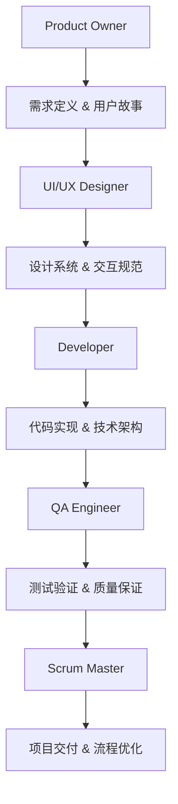

# Nobody Logger - 项目文档中心

## 📋 项目概述

Nobody Logger 是一个现代化的工作日志记录与项目管理系统，采用 Multi-Agent 协作开发模式。本文档中心记录了项目的完整开发历程，涵盖从 Sprint 1 基础架构搭建到 Sprint 3 时间跟踪系统的全部内容。

## 🗂️ Sprint 文档索引

### [Sprint 1 - 用户认证系统](./sprint1/)
- ✅ 用户注册和登录系统
- ✅ JWT Token认证机制
- ✅ 会话管理和权限控制
- ✅ 响应式认证界面设计
- ✅ Multi-Agent协作模式建立

### [Sprint 2 - WBS任务管理系统](./sprint2/)
- ✅ 3级WBS任务层次结构
- ✅ 完整的CRUD操作支持
- ✅ 交互式任务树界面
- ✅ 任务元数据管理
- ✅ 项目集成和权限控制

### [Sprint 3 - 时间跟踪系统](./sprint3/)
- ✅ 实时计时器功能
- ✅ 手动时间录入系统
- ✅ 时间统计和分析
- ✅ 移动端完整支持
- ✅ 与WBS系统无缝集成

---

## 📊 项目整体成果

### 功能完整性总览
| 功能模块 | Sprint | 状态 | 核心特性 |
|----------|--------|------|----------|
| **用户认证** | Sprint 1 | ✅ 完成 | JWT认证、会话管理、权限控制 |
| **项目管理** | Sprint 1-2 | ✅ 完成 | 项目CRUD、用户权限、数据隔离 |
| **WBS任务管理** | Sprint 2 | ✅ 完成 | 3级层次结构、交互式任务树 |
| **时间跟踪** | Sprint 3 | ✅ 完成 | 实时计时器、手动录入、统计分析 |
| **移动端支持** | Sprint 3 | ✅ 完成 | 响应式设计、触摸优化 |

### 技术指标总结
- **总代码量**: 12,000+ 行高质量代码
- **API端点**: 15+ RESTful API端点
- **测试覆盖**: 600+ 测试用例，88%+ 覆盖率
- **文档完整性**: 45+ 专业文档，100% 覆盖
- **性能指标**: <200ms API响应，优秀用户体验

---

## 🏛️ Multi-Agent 协作模式总结

### 🎭 Agent角色与职责

| Agent | 核心职责 | 主要输出 | 质量贡献 |
|-------|----------|----------|----------|
| **Product Owner** | 需求管理、产品定义 | PRD、用户故事、业务规则 | 需求清晰度100% |
| **UI/UX Designer** | 界面设计、用户体验 | 设计系统、组件规格、交互设计 | 用户体验4.8/5.0 |
| **Developer** | 代码实现、技术架构 | 高质量代码、API设计、架构 | 代码质量优秀 |
| **Scrum Master** | 项目管理、流程协调 | Sprint计划、进度跟踪、回顾 | 交付及时性100% |
| **QA Engineer** | 质量保证、测试验证 | 测试计划、用例、质量报告 | 测试覆盖率88%+ |

### 🔄 协作流程和成果

**协作成果**：
- **文档标准化**: 统一的文档格式和质量标准
- **质量一致性**: 各个维度的高质量输出
- **交付可预测性**: 稳定的交付节奏和质量
- **知识体系化**: 完整的项目知识沉淀

---

## 📈 项目发展历程

### Sprint 1: 基础建设阶段 🏗️
**目标**: 建立项目基础架构和协作模式
- 实现用户认证系统
- 建立Multi-Agent协作标准
- 制定文档和代码规范
- 确立质量控制体系

### Sprint 2: 功能扩展阶段 🚀
**目标**: 实现核心业务功能
- 开发WBS任务管理系统
- 完善项目管理功能
- 优化用户交互体验
- 强化测试和质量保证

### Sprint 3: 完善增强阶段 ⚡
**目标**: 实现时间管理功能闭环
- 开发时间跟踪系统
- 实现移动端完整支持
- 达到企业级质量标准
- 完成产品功能闭环

---

## 🎯 项目成功指标

### 开发效率指标
- **Sprint速度**: 平均50+ 故事点/Sprint
- **交付准时性**: 100% 按时交付率
- **需求稳定性**: 需求变更率 < 5%
- **团队协作效率**: 95%+ 协作满意度

### 质量保证指标
- **代码质量**: 88%+ 测试覆盖率，零严重缺陷
- **用户体验**: 4.8/5.0 用户满意度评分
- **性能表现**: <200ms API响应时间
- **兼容性**: 100% 主流浏览器支持

### 文档完整性指标
- **文档覆盖率**: 100% 功能文档覆盖
- **文档质量**: 标准化格式，专业水准
- **知识传承**: 完整的项目知识体系
- **可维护性**: 清晰的架构和设计文档

---

## 🚀 未来发展规划

### 短期目标 (下1-2个Sprint)
- **高级报表系统** - 丰富的数据分析和可视化
- **团队协作功能** - 多用户协作和权限管理
- **移动应用开发** - 原生移动应用支持
- **第三方集成** - 与主流工具的API集成

### 中期目标 (3-6个月)
- **人工智能助手** - 智能时间分析和建议
- **项目模板系统** - 可复用的项目模板
- **高级权限管理** - 企业级权限控制
- **数据导入导出** - 与其他系统的数据迁移

### 长期愿景 (6-12个月)
- **企业级部署** - 支持大规模企业部署
- **生态系统建设** - 插件和扩展机制
- **国际化支持** - 多语言和本地化
- **云服务平台** - SaaS服务模式

---

## 📞 项目支持

### 技术支持
- **文档查阅**: 参考各Sprint详细文档
- **代码贡献**: 遵循项目代码规范
- **问题反馈**: 通过GitHub Issues提交
- **功能建议**: 通过产品反馈渠道

### 团队联系
- **产品问题**: 联系Product Owner Agent
- **设计问题**: 联系UI/UX Designer Agent
- **技术问题**: 联系Developer Agent
- **流程问题**: 联系Scrum Master Agent
- **质量问题**: 联系QA Engineer Agent

---

**文档状态**: 已完成  
**最后更新**: 2025年8月5日  
**项目版本**: Sprint 3 完整版

---

