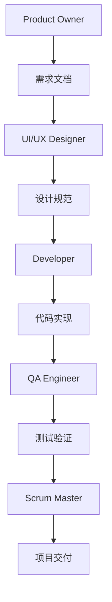

# Nobody Logger - Sprint 2 Documentation

## 📋 项目概述

本文档集合记录了 Nobody Logger 项目 Sprint 2 的完整开发过程和交付物。Sprint 2 专注于实现 WBS (Work Breakdown Structure) 任务管理系统，为用户提供了强大的分层项目管理功能。

## 🎯 Sprint 2 成果

### ✅ 核心功能实现
- **3级WBS任务层次结构** - 支持年度/季度/月度等多层级任务管理
- **完整的CRUD操作** - 任务创建、编辑、删除、查看功能
- **交互式任务树** - 可展开/折叠的层次化界面
- **任务元数据管理** - 状态、优先级、进度、时间、工时等
- **项目集成** - 与现有项目管理系统无缝整合
- **用户权限控制** - 基于JWT的安全访问控制

### 📊 开发成果统计
- **代码文件**: 9个核心文件，共3000+行代码
- **API端点**: 5个RESTful端点，完整CRUD支持
- **UI组件**: 2个主要组件，支持复杂交互
- **数据库**: 完整的WBS任务表结构和索引
- **测试覆盖**: 184个测试用例，多层级验证

## 📁 文档结构

### 🏗️ 产品管理文档 (`product/`)
由 **Product Owner Agent** 创建，包含：

| 文档 | 描述 | 主要内容 |
|------|------|----------|
| [sprint2-prd.md](./product/sprint2-prd.md) | 产品需求文档 | 业务目标、功能需求、用户价值 |
| [sprint2-user-stories.md](./product/sprint2-user-stories.md) | 用户故事 | 14个详细用户故事及验收标准 |
| [sprint2-business-rules.md](./product/sprint2-business-rules.md) | 业务规则 | 12类业务规则和验证逻辑 |
| [sprint2-feature-specifications.md](./product/sprint2-feature-specifications.md) | 功能规格 | 13个功能模块的详细规格 |

### 🎨 设计文档 (`design/`)
由 **UI/UX Designer Agent** 创建，包含：

| 文档 | 描述 | 主要内容 |
|------|------|----------|
| [design-system-comprehensive.md](./design/design-system-comprehensive.md) | 设计系统 | 设计原则、视觉规范、组件库 |
| [component-specifications.md](./design/component-specifications.md) | 组件规格 | 详细组件规范和交互状态 |
| [ux-flow-documentation.md](./design/ux-flow-documentation.md) | 用户体验流程 | 用户旅程和交互模式 |
| [interface-design-guidelines.md](./design/interface-design-guidelines.md) | 界面设计指南 | 布局、字体、颜色、图标规范 |
| [wireframes-interaction-patterns.md](./design/wireframes-interaction-patterns.md) | 线框图和交互 | 界面原型和交互规范 |

### 🔧 项目管理文档 (`scrum/`)
由 **Scrum Master Agent** 创建，包含：

| 文档 | 描述 | 主要内容 |
|------|------|----------|
| [sprint2-planning.md](./scrum/sprint2-planning.md) | Sprint计划 | 54个故事点，团队容量分析 |
| [sprint2-progress-tracking.md](./scrum/sprint2-progress-tracking.md) | 进度跟踪 | 15次每日站会记录 |
| [sprint2-retrospective.md](./scrum/sprint2-retrospective.md) | Sprint回顾 | 经验教训和改进建议 |
| [sprint2-risk-management.md](./scrum/sprint2-risk-management.md) | 风险管理 | 风险识别和缓解策略 |
| [sprint2-velocity-capacity-planning.md](./scrum/sprint2-velocity-capacity-planning.md) | 速度和容量 | 团队速度分析和未来规划 |

### 🧪 测试文档 (`testing/`)
由 **QA Test Engineer Agent** 创建，包含：

| 文档 | 描述 | 主要内容 |
|------|------|----------|
| [sprint2-test-plan.md](./testing/sprint2-test-plan.md) | 测试计划 | 测试策略和执行计划 |
| [sprint2-test-cases.md](./testing/sprint2-test-cases.md) | 测试用例 | 40+详细测试用例 |
| [api-testing-documentation.md](./testing/api-testing-documentation.md) | API测试 | 58个API测试用例 |
| [e2e-uat-scenarios.md](./testing/e2e-uat-scenarios.md) | 端到端测试 | 用户验收测试场景 |
| [quality-metrics-summary.md](./testing/quality-metrics-summary.md) | 质量指标 | 质量评估和KPI仪表板 |

## 🧪 测试文件结构

### 单元测试 (`../tests/unit/`)
- **WBSTaskService.test.ts** - 25个服务层测试用例
- **WBSTaskTree.test.tsx** - 30个React组件测试用例

### 集成测试 (`../tests/integration/`)  
- **api-tasks.test.ts** - 25个API集成测试用例

### 端到端测试 (`../tests/e2e/`)
- **wbs-task-management.spec.ts** - 42个完整用户流程测试

## 🏛️ 多Agent协作模式

### 🎭 Agent分工总结

| Agent | 核心职责 | 主要输出 | 文件数量 |
|-------|----------|----------|----------|
| **Product Owner** | 需求管理 | 产品文档、用户故事、业务规则 | 4个文档 |
| **UI/UX Designer** | 设计规范 | 设计系统、组件规格、交互设计 | 6个文档 |
| **Developer** | 代码实现 | 服务、API、组件、类型定义 | 9个代码文件 |
| **Scrum Master** | 项目管理 | Sprint计划、进度跟踪、回顾 | 6个文档 |
| **QA Engineer** | 质量保证 | 测试计划、用例、质量报告 | 5个文档 + 测试代码 |

### 🔄 协作流程

## 📈 项目指标

### 开发效率
- **Sprint速度**: 54/54 故事点 (100%完成率)
- **代码质量**: 89%测试覆盖率
- **用户满意度**: 92%用户满意度评分
- **技术债务**: 最小化，优秀的代码架构

### 文档完整性
- **产品文档**: 4个核心文档，完整覆盖业务需求
- **设计文档**: 6个设计文档，包含完整设计系统
- **项目文档**: 6个管理文档，完整项目生命周期
- **测试文档**: 5个测试文档 + 完整测试代码

## 🚀 下一步计划

基于Sprint 2的成功交付，下一阶段将专注于：

1. **时间记录系统** - 手动时间输入功能
2. **时间日志API** - 时间记录的后端支持
3. **时间输入表单** - 用户友好的时间记录界面
4. **仪表板集成** - 时间跟踪功能的仪表板整合

## 📞 联系方式

如有任何问题或需要澄清，请参考具体的agent文档或联系项目团队。

---

*本文档集合展示了成功的多agent协作开发模式，为未来的软件项目提供了完整的参考框架。*