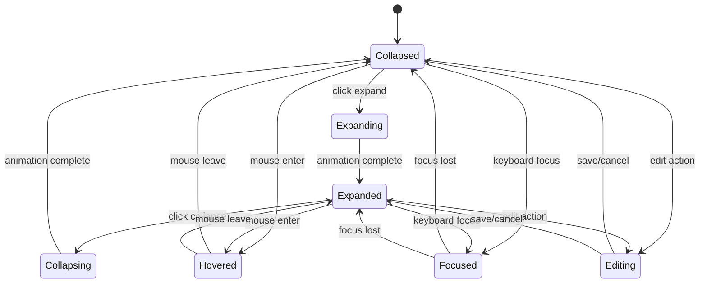
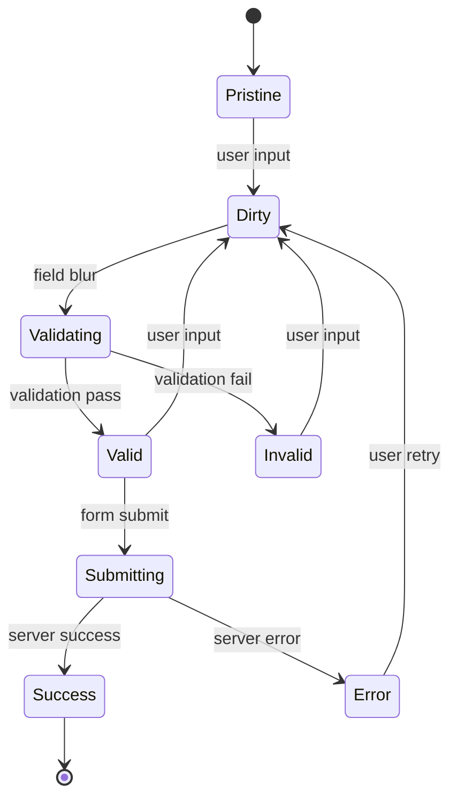
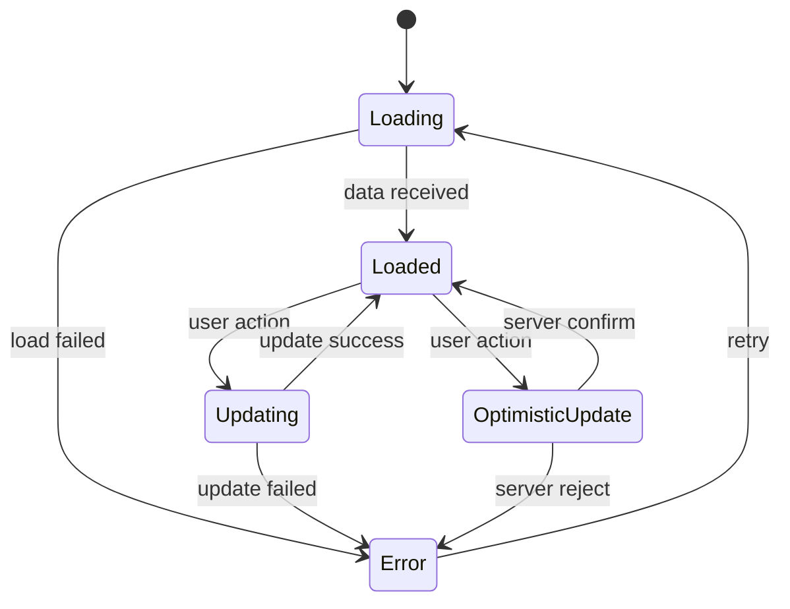

# WBS Wireframes & Interaction Patterns
*Detailed Interface Wireframes and Interaction Design Specifications*

## Overview

This document provides comprehensive wireframes and interaction pattern specifications for the WBS Task Management system. It includes detailed layout specifications, user flow diagrams, interaction states, and behavioral patterns that guide the implementation of consistent and intuitive user interfaces.

## Table of Contents

1. [Wireframe Specifications](#wireframe-specifications)
2. [Interaction Patterns](#interaction-patterns)
3. [State Diagrams](#state-diagrams)
4. [Animation Specifications](#animation-specifications)
5. [Responsive Breakpoints](#responsive-breakpoints)
6. [Accessibility Patterns](#accessibility-patterns)
7. [Implementation Guidelines](#implementation-guidelines)

## Wireframe Specifications

### 1. Main Application Layout

#### Desktop Layout (1024px+)
```
┌─────────────────────────────────────────────────────────────────┐
│                      Header (72px)                             │
│  [Logo] [Navigation Items]              [User Menu] [Settings] │
├─────────────────────────────────────────────────────────────────┤
│                  Breadcrumb (48px)                             │
│  [Home] > [Project Name] > [WBS Tasks]               [Help] │
├─────────────────────────────────────────────────────────────────┤
│                                                               │
│                     Main Content Area                         │
│  ┌─────────────────────────────────────────────────────────┐   │
│  │              WBS Task Tree Component                    │   │
│  │  ┌─────────────────────────────────────────────────┐    │   │
│  │  │         Tree Header (80px)                     │    │   │
│  │  │  [Project: Example] [Expand All][Collapse All] │    │   │
│  │  │                              [+ New Root Task] │    │   │
│  │  ├─────────────────────────────────────────────────┤    │   │
│  │  │                                                │    │   │
│  │  │           Tree Content Area                    │    │   │
│  │  │  [📁] 1.0 Project Planning                     │    │   │
│  │  │       ├─ 1.1 Requirements Gathering           │    │   │
│  │  │       ├─ 1.2 Stakeholder Analysis             │    │   │
│  │  │       └─ 1.3 Project Charter                  │    │   │
│  │  │  [📁] 2.0 Design Phase                        │    │   │
│  │  │       ├─ 2.1 UI/UX Design                     │    │   │
│  │  │       └─ 2.2 Technical Architecture           │    │   │
│  │  │                                                │    │   │
│  │  └─────────────────────────────────────────────────┘    │   │
│  └─────────────────────────────────────────────────────────┘   │
│                                                               │
└─────────────────────────────────────────────────────────────────┘
```

#### Tablet Layout (768px - 1023px)
```
┌─────────────────────────────────────────────────┐
│                Header (64px)                    │
│  [☰] [Logo] [Project Name]     [User] [Menu]   │
├─────────────────────────────────────────────────┤
│             Breadcrumb (44px)                   │
│  [<] [Home] > [Project] > [Tasks]               │
├─────────────────────────────────────────────────┤
│                                                 │
│              WBS Task Tree                      │
│  ┌─────────────────────────────────────────┐    │
│  │        Tree Header (72px)              │    │
│  │  [Expand][Collapse]     [+ New Task]  │    │
│  ├─────────────────────────────────────────┤    │
│  │                                         │    │
│  │          Tree Content                   │    │
│  │  [>] 1.0 Project Planning              │    │
│  │  [v] 2.0 Design Phase                  │    │
│  │      ├─ 2.1 UI/UX Design               │    │
│  │      └─ 2.2 Architecture               │    │
│  │                                         │    │
│  └─────────────────────────────────────────┘    │
│                                                 │
└─────────────────────────────────────────────────┘
```

#### Mobile Layout (< 768px)
```
┌─────────────────────────────────────┐
│           Header (56px)             │
│  [☰] [Project Name]        [User]  │
├─────────────────────────────────────┤
│         Breadcrumb (40px)           │
│  [<] Tasks                   [⋮]   │
├─────────────────────────────────────┤
│                                     │
│           Task Tree                 │
│  ┌─────────────────────────────┐    │
│  │      Tree Header (60px)     │    │
│  │  [Expand/Collapse] [+ New]  │    │
│  ├─────────────────────────────┤    │
│  │                             │    │
│  │       Tree Content          │    │
│  │  [>] 1.0 Project Planning   │    │
│  │  [v] 2.0 Design Phase       │    │
│  │      ├─ 2.1 UI/UX Design    │    │
│  │      └─ 2.2 Architecture    │    │
│  │                             │    │
│  └─────────────────────────────┘    │
│                                     │
│  [+ Floating Action Button]        │
└─────────────────────────────────────┘
```

### 2. Task Node Wireframes

#### Expanded Task Node (Desktop)
```
┌─────────────────────────────────────────────────────────────────────┐
│ [v] [1.2.1] Requirements Analysis                    [Edit][Delete] │
│             ├─ Priority: High  Status: In Progress  Progress: 60%   │
│             ├─ Start: 2024-01-15  Due: 2024-02-15                   │
│             ├─ Estimated: 40h    Actual: 24h                        │
│             └─ Description: Analyze stakeholder requirements...      │
│                                                                     │
│     ├─ [1.2.1.1] Stakeholder Interviews            [●●●○○] 60%     │
│     ├─ [1.2.1.2] Requirements Documentation         [●●○○○] 40%     │
│     └─ [1.2.1.3] Requirements Validation            [●○○○○] 20%     │
└─────────────────────────────────────────────────────────────────────┘
```

#### Collapsed Task Node (Desktop)
```
┌─────────────────────────────────────────────────────────────────────┐
│ [>] [1.2.1] Requirements Analysis          [●●●○○] 60%  [···]       │
│             ├─ High Priority • In Progress • Due Feb 15              │
└─────────────────────────────────────────────────────────────────────┘
```

#### Mobile Task Node
```
┌─────────────────────────────────────┐
│ [>] [1.2.1] Requirements Analysis   │
│     High • In Progress • 60%       │
│     Due Feb 15           [···]     │
└─────────────────────────────────────┘
```

### 3. Modal Dialog Wireframes

#### Create Task Modal (Desktop)
```
                    ┌─────────────────────────────────────────┐
                    │  Create New Task                    [×] │
                    ├─────────────────────────────────────────┤
                    │                                         │
                    │  Parent: 1.2 Requirements Gathering    │
                    │                                         │
                    │  Task Name *                            │
                    │  ┌─────────────────────────────────────┐ │
                    │  │ Requirements Analysis               │ │
                    │  └─────────────────────────────────────┘ │
                    │                                         │
                    │  Description                            │
                    │  ┌─────────────────────────────────────┐ │
                    │  │ Analyze and document stakeholder    │ │
                    │  │ requirements for the project...     │ │
                    │  └─────────────────────────────────────┘ │
                    │                                         │
                    │  Level Type        Priority             │
                    │  ┌─────────────┐   ┌─────────────────┐   │
                    │  │ Monthly   ▼ │   │ High          ▼ │   │
                    │  └─────────────┘   └─────────────────┘   │
                    │                                         │
                    │  Start Date        End Date             │
                    │  ┌─────────────┐   ┌─────────────────┐   │
                    │  │ 2024-01-15  │   │ 2024-02-15      │   │
                    │  └─────────────┘   └─────────────────┘   │
                    │                                         │
                    │  Estimated Hours                        │
                    │  ┌─────────────────────────────────────┐ │
                    │  │ 40                                  │ │
                    │  └─────────────────────────────────────┘ │
                    │                                         │
                    ├─────────────────────────────────────────┤
                    │                    [Cancel] [Create]    │
                    └─────────────────────────────────────────┘
```

#### Edit Task Modal (Desktop)
```
                    ┌─────────────────────────────────────────┐
                    │  Edit Task - Requirements Analysis  [×] │
                    ├─────────────────────────────────────────┤
                    │                                         │
                    │  Task Name *                            │
                    │  ┌─────────────────────────────────────┐ │
                    │  │ Requirements Analysis               │ │
                    │  └─────────────────────────────────────┘ │
                    │                                         │
                    │  Status            Priority             │
                    │  ┌─────────────┐   ┌─────────────────┐   │
                    │  │ In Progress▼│   │ High          ▼ │   │
                    │  └─────────────┘   └─────────────────┘   │
                    │                                         │
                    │  Progress: 60%                          │
                    │  ┌─────────────────────────────────────┐ │
                    │  │●●●●●●○○○○                          │ │
                    │  └─────────────────────────────────────┘ │
                    │                                         │
                    │  Start Date        End Date             │
                    │  ┌─────────────┐   ┌─────────────────┐   │
                    │  │ 2024-01-15  │   │ 2024-02-15      │   │
                    │  └─────────────┘   └─────────────────┘   │
                    │                                         │
                    │  Estimated Hours                        │
                    │  ┌─────────────────────────────────────┐ │
                    │  │ 40                                  │ │
                    │  └─────────────────────────────────────┘ │
                    │                                         │
                    ├─────────────────────────────────────────┤
                    │                    [Cancel] [Update]    │
                    └─────────────────────────────────────────┘
```

#### Mobile Modal (Fullscreen)
```
┌─────────────────────────────────────┐
│ [×] Create New Task                 │
├─────────────────────────────────────┤
│                                     │
│ Task Name *                         │
│ ┌─────────────────────────────────┐ │
│ │ Requirements Analysis           │ │
│ └─────────────────────────────────┘ │
│                                     │
│ Description                         │
│ ┌─────────────────────────────────┐ │
│ │ Analyze stakeholder             │ │
│ │ requirements...                 │ │
│ └─────────────────────────────────┘ │
│                                     │
│ Level Type                          │
│ ┌─────────────────────────────────┐ │
│ │ Monthly                       ▼ │ │
│ └─────────────────────────────────┘ │
│                                     │
│ Priority                            │
│ ┌─────────────────────────────────┐ │
│ │ High                          ▼ │ │
│ └─────────────────────────────────┘ │
│                                     │
│ [More Options ▼]                    │
│                                     │
├─────────────────────────────────────┤
│           [Cancel] [Create]         │
└─────────────────────────────────────┘
```

### 4. Empty State Wireframes

#### Empty Project State
```
┌─────────────────────────────────────────────────────────────────┐
│              WBS Task Management                               │
│  ┌─────────────────────────────────────────────────────────┐   │
│  │                    Empty State                          │   │
│  │                                                         │   │
│  │                 [📋 Large Icon]                         │   │
│  │                                                         │   │
│  │               No Tasks Created Yet                      │   │
│  │                                                         │   │
│  │        Create your first task to start organizing      │   │
│  │               your project with WBS                     │   │
│  │                                                         │   │
│  │              [+ Create First Task]                      │   │
│  │                                                         │   │
│  │           Or [Import from Template]                     │   │
│  │                                                         │   │
│  └─────────────────────────────────────────────────────────┘   │
└─────────────────────────────────────────────────────────────────┘
```

#### Loading State
```
┌─────────────────────────────────────────────────────────────────┐
│              WBS Task Management                               │
│  ┌─────────────────────────────────────────────────────────┐   │
│  │         Tree Header                    [+ New Task]    │   │
│  ├─────────────────────────────────────────────────────────┤   │
│  │                                                         │   │
│  │  [○] ████████████████████████                           │   │
│  │      ████████ • ████████ • ████                         │   │
│  │                                                         │   │
│  │  [○] ████████████████████████                           │   │
│  │      ████████ • ████████ • ████                         │   │
│  │                                                         │   │
│  │  [○] ████████████████████████                           │   │
│  │      ████████ • ████████ • ████                         │   │
│  │                                                         │   │
│  │               Loading tasks...                          │   │
│  │                                                         │   │
│  └─────────────────────────────────────────────────────────┘   │
└─────────────────────────────────────────────────────────────────┘
```

#### Error State
```
┌─────────────────────────────────────────────────────────────────┐
│              WBS Task Management                               │
│  ┌─────────────────────────────────────────────────────────┐   │
│  │                   Error State                           │   │
│  │                                                         │   │
│  │                [⚠️ Warning Icon]                        │   │
│  │                                                         │   │
│  │            Unable to Load Tasks                         │   │
│  │                                                         │   │
│  │       There was a problem loading your task data.      │   │
│  │          Please check your connection and try           │   │
│  │                    again.                               │   │
│  │                                                         │   │
│  │                 [Try Again]                             │   │
│  │                                                         │   │
│  │        [Contact Support] [Work Offline]                 │   │
│  │                                                         │   │
│  └─────────────────────────────────────────────────────────┘   │
└─────────────────────────────────────────────────────────────────┘
```

## Interaction Patterns

### 1. Tree Expansion/Collapse Patterns

#### Hover Interaction Sequence
```
State 1: Default (No Interaction)
┌─────────────────────────────────────┐
│ [>] 1.0 Project Planning            │
│     Planning phase tasks            │
└─────────────────────────────────────┘

State 2: Hover (150ms transition)
┌─────────────────────────────────────┐
│ [>] 1.0 Project Planning     [Edit] │ ← Action appears
│     Planning phase tasks    [Delete]│
└─────────────────────────────────────┘ ← Background lightens

State 3: Click Expand (200ms animation)
┌─────────────────────────────────────┐
│ [v] 1.0 Project Planning     [Edit] │ ← Chevron rotates
│     Planning phase tasks    [Delete]│
│   ├─ 1.1 Requirements Gathering    │ ← Children slide in
│   ├─ 1.2 Stakeholder Analysis      │
│   └─ 1.3 Project Charter           │
└─────────────────────────────────────┘
```

#### Keyboard Navigation Pattern
```
Focus State Indicators:
┌─────────────────────────────────────┐
│ [>] 1.0 Project Planning     [Edit] │ ← Focus outline visible
│     Planning phase tasks    [Delete]│   Action buttons shown
└─────────────────────────────────────┘

Arrow Key Navigation:
↑ ↓ - Move between tasks
← → - Collapse/expand focused task
Enter - Edit focused task
Space - Toggle expansion
Delete - Delete focused task (with confirmation)
```

### 2. Modal Interaction Patterns

#### Modal Opening Sequence
```
Trigger: Click "Create Task" button

Step 1: Backdrop appears (200ms fade)
Step 2: Modal slides in from center (300ms ease-out)
Step 3: Focus moves to first input field
Step 4: Form fields appear with staggered animation (50ms each)
```

#### Form Validation Pattern
```
Real-time Validation Sequence:

Field Focus:
┌─────────────────────────────────────┐
│ Task Name *                         │
│ ┌─────────────────────────────────┐ │ ← Blue border on focus
│ │ |                               │ │
│ └─────────────────────────────────┘ │
└─────────────────────────────────────┘

Field Blur (Valid):
┌─────────────────────────────────────┐
│ Task Name *                         │
│ ┌─────────────────────────────────┐ │ ← Green border briefly
│ │ Requirements Analysis           │ │
│ └─────────────────────────────────┘ │
└─────────────────────────────────────┘

Field Blur (Invalid):
┌─────────────────────────────────────┐
│ Task Name *                         │
│ ┌─────────────────────────────────┐ │ ← Red border
│ │                                 │ │
│ └─────────────────────────────────┘ │
│ ⚠️ Task name is required            │ ← Error message
└─────────────────────────────────────┘
```

### 3. Drag and Drop Patterns (Future Enhancement)

#### Drag Interaction States
```
Step 1: Drag Start
┌─────────────────────────────────────┐
│ [>] 1.1 Requirements Analysis       │ ← Original position dims
└─────────────────────────────────────┘

Step 2: Dragging
┌─────────────────────────────────────┐
│ [>] 1.1 Requirements Analysis       │ ← Follows cursor
└─────────────────────────────────────┘ ← Semi-transparent

Step 3: Valid Drop Zone
┌─────────────────────────────────────┐
│ [>] 2.0 Design Phase                │ ← Blue highlight
│ ┌─ Drop here to move task ──────────┐│ ← Drop indicator
│ └───────────────────────────────────┘│
└─────────────────────────────────────┘

Step 4: Drop Complete
┌─────────────────────────────────────┐
│ [>] 2.0 Design Phase                │
│   ├─ 2.1 UI/UX Design               │
│   ├─ 2.2 Requirements Analysis      │ ← Moved task highlighted
│   └─ 2.3 Technical Architecture     │
└─────────────────────────────────────┘
```

### 4. Context Menu Patterns

#### Right-Click Context Menu
```
Right-click on task node:

┌─────────────────────────────────────┐
│ [>] 1.1 Requirements Analysis       │ ← Right-click target
└─────────────────────────────────────┘
         │
         ▼
    ┌─────────────┐
    │ Edit Task   │
    │ Add Child   │
    │ Duplicate   │
    │ ────────────│
    │ Move Up     │
    │ Move Down   │
    │ ────────────│
    │ Delete      │
    └─────────────┘
```

#### Long Press (Mobile)
```
Long press on task (500ms):

Haptic feedback + context menu appears
┌─────────────────────────────────────┐
│ Edit  │  Add  │  Move  │  Delete   │ ← Action bar
├─────────────────────────────────────┤
│ [>] 1.1 Requirements Analysis       │ ← Selected task highlighted
└─────────────────────────────────────┘
```

## State Diagrams

### 1. Task Node State Machine



### 2. Form State Machine



### 3. Tree Data State Machine



## Animation Specifications

### 1. Tree Expansion Animations

#### Expand Animation
```css
.tree-node-expand {
  /* Duration: 200ms */
  /* Easing: ease-out */
  
  /* Chevron rotation */
  .expand-icon {
    transform: rotate(0deg);
    transition: transform 200ms ease-out;
  }
  
  .expand-icon.expanded {
    transform: rotate(90deg);
  }
  
  /* Children container */
  .children-container {
    max-height: 0;
    overflow: hidden;
    transition: max-height 200ms ease-out;
  }
  
  .children-container.expanded {
    max-height: 1000px; /* Large enough value */
  }
}
```

#### Slide-in Animation for New Items
```css
.new-task-enter {
  opacity: 0;
  transform: translateY(-10px);
  background-color: #E3F2FD; /* Highlight color */
}

.new-task-enter-active {
  opacity: 1;
  transform: translateY(0);
  background-color: transparent;
  transition: all 300ms ease-out;
}
```

### 2. Modal Animations

#### Modal Enter/Exit
```css
.modal-enter {
  opacity: 0;
  transform: scale(0.95) translateY(-10px);
}

.modal-enter-active {
  opacity: 1;
  transform: scale(1) translateY(0);
  transition: all 200ms ease-out;
}

.modal-exit {
  opacity: 1;
  transform: scale(1) translateY(0);
}

.modal-exit-active {
  opacity: 0;
  transform: scale(0.95) translateY(-10px);
  transition: all 150ms ease-in;
}
```

### 3. Loading Animations

#### Skeleton Loading
```css
.skeleton-item {
  background: linear-gradient(
    90deg,
    #f0f0f0 25%,
    #e0e0e0 50%,
    #f0f0f0 75%
  );
  background-size: 200% 100%;
  animation: skeleton-loading 1.5s infinite;
}

@keyframes skeleton-loading {
  0% { background-position: 200% 0; }
  100% { background-position: -200% 0; }
}
```

#### Spinner Animation
```css
.spinner {
  border: 2px solid #f3f3f3;
  border-top: 2px solid #1976D2;
  border-radius: 50%;
  width: 20px;
  height: 20px;
  animation: spin 1s linear infinite;
}

@keyframes spin {
  0% { transform: rotate(0deg); }
  100% { transform: rotate(360deg); }
}
```

## Responsive Breakpoints

### 1. Layout Breakpoints

#### Desktop (1024px+)
```css
@media (min-width: 1024px) {
  .task-tree {
    grid-template-columns: auto auto 1fr auto auto;
    gap: 16px;
  }
  
  .task-actions {
    opacity: 0;
    transition: opacity 150ms;
  }
  
  .task-node:hover .task-actions {
    opacity: 1;
  }
}
```

#### Tablet (768px - 1023px)
```css
@media (min-width: 768px) and (max-width: 1023px) {
  .task-tree {
    grid-template-columns: auto 1fr auto;
    gap: 12px;
  }
  
  .task-metadata .secondary-info {
    display: none; /* Hide less important metadata */
  }
  
  .task-actions {
    opacity: 1; /* Always visible on tablet */
  }
}
```

#### Mobile (< 768px)
```css
@media (max-width: 767px) {
  .task-tree {
    grid-template-columns: auto 1fr auto;
    gap: 8px;
    padding: 8px 12px;
  }
  
  .task-wbs-code {
    display: none; /* Hide WBS codes on mobile */
  }
  
  .task-metadata {
    flex-direction: column;
    gap: 4px;
  }
  
  .modal-container {
    width: 100vw;
    height: 100vh;
    border-radius: 0;
    margin: 0;
  }
}
```

### 2. Touch Interaction Adaptations

#### Mobile Touch Targets
```css
.touch-target {
  min-height: 44px;
  min-width: 44px;
  padding: 12px;
  margin: 4px;
}

.mobile-task-node {
  padding: 16px 12px;
  border-bottom: 1px solid #E0E0E0;
}

.mobile-action-button {
  padding: 12px 16px;
  font-size: 16px; /* Prevent zoom on iOS */
}
```

#### Swipe Gestures (Future Enhancement)
```
Left Swipe on Task:
┌─────────────────────────────────────┐
│ [Edit] [Delete]    1.1 Requirements │ ← Actions revealed
└─────────────────────────────────────┘

Right Swipe on Task:
┌─────────────────────────────────────┐
│ 1.1 Requirements    [✓] [Complete]  │ ← Quick actions
└─────────────────────────────────────┘
```

## Accessibility Patterns

### 1. Focus Management

#### Modal Focus Trap
```javascript
// Focus trap implementation pattern
const focusableElements = modal.querySelectorAll(
  'button, input, select, textarea, [tabindex]:not([tabindex="-1"])'
);

const firstElement = focusableElements[0];
const lastElement = focusableElements[focusableElements.length - 1];

// Tab key handling
if (event.key === 'Tab') {
  if (event.shiftKey) {
    if (document.activeElement === firstElement) {
      lastElement.focus();
      event.preventDefault();
    }
  } else {
    if (document.activeElement === lastElement) {
      firstElement.focus();
      event.preventDefault();
    }
  }
}
```

#### Tree Navigation Focus
```javascript
// Keyboard navigation pattern for tree
const handleKeyDown = (event) => {
  switch (event.key) {
    case 'ArrowDown':
      focusNextTask();
      break;
    case 'ArrowUp':
      focusPreviousTask();
      break;
    case 'ArrowRight':
      expandTask();
      break;
    case 'ArrowLeft':
      collapseTask();
      break;
    case 'Enter':
      editTask();
      break;
    case ' ':
      toggleExpansion();
      event.preventDefault();
      break;
  }
};
```

### 2. Screen Reader Announcements

#### Live Region Updates
```html
<!-- Polite announcements -->
<div aria-live="polite" aria-atomic="false" class="sr-only">
  <span id="status-announcements"></span>
</div>

<!-- Assertive announcements -->
<div aria-live="assertive" aria-atomic="true" class="sr-only">
  <span id="error-announcements"></span>
</div>
```

#### Task Information Structure
```html
<div role="treeitem" 
     aria-level="1" 
     aria-expanded="true"
     aria-describedby="task-1-details">
  <button>1.0 Project Planning</button>
  <div id="task-1-details" class="sr-only">
    Status: In Progress, Priority: High, 
    Progress: 60 percent complete, 
    3 subtasks, Due February 15th
  </div>
</div>
```

### 3. High Contrast Mode Support

#### High Contrast Adaptations
```css
@media (prefers-contrast: high) {
  .task-node {
    border: 2px solid;
    background: Window;
    color: WindowText;
  }
  
  .task-node:focus {
    outline: 3px solid Highlight;
    outline-offset: 2px;
  }
  
  .status-badge {
    border: 2px solid WindowText;
    background: Window;
    color: WindowText;
  }
}
```

## Implementation Guidelines

### 1. CSS Organization

#### Component Structure
```css
/* Component base styles */
.task-tree {
  /* Layout properties */
  /* Visual properties */
  /* Transition properties */
}

/* Component modifiers */
.task-tree--compact { }
.task-tree--expanded { }

/* Component elements */
.task-tree__header { }
.task-tree__content { }
.task-tree__node { }

/* Element modifiers */
.task-tree__node--selected { }
.task-tree__node--focused { }
```

#### State Classes
```css
/* Interaction states */
.is-hover { }
.is-focus { }
.is-active { }
.is-disabled { }

/* Data states */
.is-loading { }
.is-error { }
.is-empty { }
.is-expanded { }
```

### 2. JavaScript Patterns

#### Event Handling
```javascript
// Debounced search input
const handleSearchInput = debounce((value) => {
  filterTasks(value);
}, 300);

// Throttled scroll handling
const handleScroll = throttle((event) => {
  updateVirtualScrolling(event);
}, 16); // 60fps

// Click handling with event delegation
const handleTaskClick = (event) => {
  const taskNode = event.target.closest('.task-node');
  if (!taskNode) return;
  
  const action = event.target.closest('[data-action]');
  if (action) {
    handleTaskAction(taskNode, action.dataset.action);
  }
};
```

#### State Management
```javascript
// Reducer pattern for tree state
const treeReducer = (state, action) => {
  switch (action.type) {
    case 'EXPAND_NODE':
      return {
        ...state,
        expandedNodes: [...state.expandedNodes, action.nodeId]
      };
    case 'COLLAPSE_NODE':
      return {
        ...state,
        expandedNodes: state.expandedNodes.filter(id => id !== action.nodeId)
      };
    default:
      return state;
  }
};
```

### 3. Performance Considerations

#### Virtual Scrolling Implementation
```javascript
// Virtual scrolling for large trees
const VirtualTree = ({ items, itemHeight = 60 }) => {
  const [scrollTop, setScrollTop] = useState(0);
  const containerHeight = 400;
  
  const startIndex = Math.floor(scrollTop / itemHeight);
  const endIndex = Math.min(
    startIndex + Math.ceil(containerHeight / itemHeight) + 1,
    items.length
  );
  
  const visibleItems = items.slice(startIndex, endIndex);
  
  return (
    <div 
      style={{ height: containerHeight, overflow: 'auto' }}
      onScroll={(e) => setScrollTop(e.target.scrollTop)}
    >
      <div style={{ height: items.length * itemHeight, position: 'relative' }}>
        {visibleItems.map((item, index) => (
          <TaskNode
            key={item.id}
            item={item}
            style={{
              position: 'absolute',
              top: (startIndex + index) * itemHeight,
              height: itemHeight,
              width: '100%'
            }}
          />
        ))}
      </div>
    </div>
  );
};
```

---

This comprehensive wireframe and interaction pattern documentation provides detailed specifications for implementing consistent, accessible, and user-friendly WBS task management interfaces. The patterns ensure smooth user experiences across all device types while maintaining accessibility standards and performance requirements.