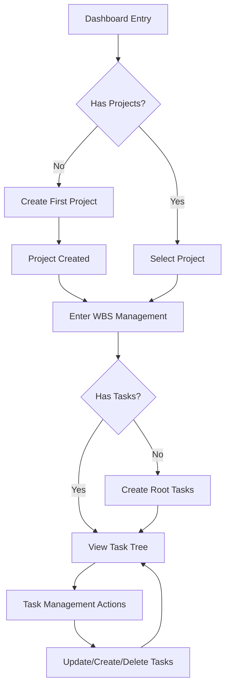

# WBS Task Management - User Experience Flow Documentation
*Comprehensive UX Flow and Interaction Patterns*

## Overview

This document details the complete user experience flows for the WBS Task Management system, including user journeys, interaction patterns, decision points, and usability considerations. Each flow is designed to optimize task completion efficiency while maintaining accessibility and error prevention.

## Table of Contents

1. [User Journey Overview](#user-journey-overview)
2. [Primary User Flows](#primary-user-flows)
3. [Interaction Patterns](#interaction-patterns)
4. [Error Handling Flows](#error-handling-flows)
5. [Accessibility Considerations](#accessibility-considerations)
6. [Mobile Experience Flows](#mobile-experience-flows)
7. [Performance Optimization](#performance-optimization)

## User Journey Overview

### User Personas

#### Primary User: Project Manager
- **Goals**: Organize tasks hierarchically, track progress, manage team workload
- **Context**: Desktop-primary, manages multiple projects simultaneously
- **Pain Points**: Complex navigation, unclear task relationships, slow operations

#### Secondary User: Team Member
- **Goals**: View assigned tasks, update progress, understand dependencies
- **Context**: Mixed desktop/mobile usage, focused on specific task areas
- **Pain Points**: Finding relevant tasks, understanding hierarchy context

#### Tertiary User: Stakeholder
- **Goals**: Monitor project progress, understand task breakdown, review deliverables
- **Context**: Occasional usage, needs quick overview capabilities
- **Pain Points**: Information overload, unclear project status

### Core User Flows



## Primary User Flows

### 1. Project Selection and Entry Flow

#### Entry Points
- **Dashboard Navigation**: Main dashboard with project grid
- **Direct URL**: Deep link to specific project WBS
- **Breadcrumb Navigation**: Return from other project sections

#### Flow Steps

**Step 1: Project Discovery**
```
User Intent: Find and access project
Entry Point: Dashboard
```

**Visual Layout:**
- Grid of project cards (responsive: 3 cols desktop, 2 cols tablet, 1 col mobile)
- Each card shows: project name, color indicator, description, last modified
- Search/filter controls above grid
- "Create Project" primary action button

**Interactions:**
- Hover reveals additional project metadata
- Click anywhere on card enters project
- Right-click or long-press shows context menu
- Keyboard navigation with arrow keys

**Decision Points:**
- User has projects → Show grid
- No projects → Empty state with create CTA
- Search active → Filter results
- Loading state → Skeleton placeholders

**Step 2: Project Entry**
```
Trigger: Click project card
Action: Navigate to WBS view
```

**Transition Animation:**
- Card scales up slightly (1.02x)
- Fade to WBS interface (300ms ease-out)
- Breadcrumb appears with project name
- Loading indicator during data fetch

**Success Criteria:**
- WBS tree loads within 2 seconds
- Breadcrumb shows correct navigation path
- Tree displays with proper hierarchy
- User can immediately interact with interface

### 2. Task Tree Navigation Flow

#### Initial Tree Display

**Loading Sequence:**
1. **Skeleton State** (0-500ms): Tree structure with placeholder nodes
2. **Progressive Loading** (500-1500ms): Root tasks load first, children on demand
3. **Complete State** (1500ms+): Full tree with metadata and actions

**Default Tree State:**
- Root tasks expanded to show immediate children
- Subsequent levels collapsed to prevent overwhelm
- Maximum 50 visible nodes initially (virtualization beyond)

#### Navigation Patterns

**Expansion/Collapse Flow:**
```
User Action: Click chevron icon
Immediate Response: Icon rotation (150ms)
State Change: Toggle node expansion
Visual Feedback: Smooth height animation (200ms)
Persistence: Remember expansion state during session
```

**Tree Traversal:**
- **Mouse Navigation**: Click to expand/collapse, hover for actions
- **Keyboard Navigation**: Arrow keys for focus, Space/Enter for actions
- **Touch Navigation**: Tap to expand, long-press for context menu

**Bulk Operations:**
- **Expand All**: Progressively expands tree with staggered animation
- **Collapse All**: Simultaneously collapses all nodes
- **Find in Tree**: Expands path to search result

#### Information Progressive Disclosure

**Level 1 (Always Visible):**
- WBS code
- Task name
- Status badge
- Progress bar with percentage

**Level 2 (Hover/Focus):**
- Action buttons (edit, delete, add child)
- Priority indicator
- Due date (if set)

**Level 3 (Click/Expand Details):**
- Full description
- Estimated vs actual hours
- Assignment information
- Dependencies

### 3. Task Creation Flow

#### Entry Points and Triggers

**Primary Entry Points:**
1. **Root Task Creation**: "New Root Task" button in header
2. **Child Task Creation**: "Add Child" button on task node
3. **Context Menu**: Right-click → "Add Task" option
4. **Keyboard Shortcut**: Ctrl+N (configurable)

#### Creation Flow Steps

**Step 1: Flow Initiation**
```
Trigger: User clicks "New Task" button
Context: Determine if root task or child task
Modal: Task creation form opens
Focus: Automatically focus on task name field
```

**Modal Opening Animation:**
- Backdrop fades in (200ms)
- Modal scales from 0.95 to 1.0 (200ms ease-out)
- Form fields appear with staggered fade-in

**Step 2: Form Interaction**
```
Smart Defaults Applied:
- Level type based on parent (if child task)
- Priority defaults to "medium"
- Status defaults to "not_started"
- Progress defaults to 0%
```

**Real-time Validation:**
- **Task Name**: Required, 1-100 characters, unique within level
- **Dates**: End date must be after start date
- **Hours**: Positive number, maximum 9999
- **Level Type**: Automatically determined for child tasks

**Progressive Form Revelation:**
```
Basic Information (Always Shown):
├── Task Name (Required)
├── Description (Optional)
└── Level Type (Auto-determined for children)

Advanced Options (Collapsible):
├── Priority Selection
├── Date Range
├── Estimated Hours
└── Initial Status
```

**Step 3: Form Submission**
```
Validation Sequence:
1. Client-side validation on blur/change
2. Form-wide validation on submit attempt
3. Server-side validation and response
4. Error handling or success processing
```

**Success Flow:**
- Form submission triggers loading state
- Success response closes modal (300ms fade-out)
- New task appears in tree with highlight animation
- Focus moves to new task node
- Success toast notification (3-second auto-dismiss)

**Error Flow:**
- Validation errors appear inline below fields
- Form remains open with errors highlighted
- Submit button remains accessible for retry
- Error summary at top of form for screen readers

### 4. Task Editing Flow

#### Edit Trigger Patterns

**Direct Edit Triggers:**
- Click edit icon on task node
- Double-click task name
- Press Enter when task is focused
- Context menu → "Edit Task"

**Batch Edit Triggers:**
- Select multiple tasks → "Edit Selected"
- Filter view → "Edit All Visible"

#### Edit Modal Flow

**Step 1: Edit Initiation**
```
Trigger: User clicks edit button
Data Loading: Pre-populate form with current values
Modal State: Edit mode (different styling from create)
Form Focus: Initially focus on task name field
```

**Pre-population Logic:**
- All current field values loaded
- Form validation state reset
- Modified field tracking enabled
- Unsaved changes warning prepared

**Step 2: Change Detection**
```
Change Tracking:
- Track which fields have been modified
- Enable "unsaved changes" warning
- Smart save button state (disabled if no changes)
- Keyboard shortcut for save (Ctrl+S)
```

**Real-time Updates:**
- Form changes reflected immediately in UI
- Validation occurs on field blur
- Related fields update automatically (e.g., level type affects children)

**Step 3: Save Process**
```
Save Sequence:
1. Validate all modified fields
2. Show loading state on save button
3. Submit only changed fields to server
4. Handle success/error responses
5. Update tree with new data
6. Close modal or show errors
```

**Optimistic Updates:**
- Changes appear immediately in tree
- Loading indicator on modified task
- Revert changes if save fails
- Success confirmation via subtle animation

### 5. Task Deletion Flow

#### Deletion Triggers and Context

**Direct Deletion:**
- Click delete button on task node
- Press Delete key when task is focused
- Context menu → "Delete Task"

**Bulk Deletion:**
- Select multiple tasks → "Delete Selected"
- Filter + "Delete All Visible" (with extra confirmation)

#### Deletion Confirmation Flow

**Step 1: Deletion Request**
```
Trigger: User initiates deletion
Context Check: Determine if task has children
Confirmation Modal: Show appropriate warning level
```

**Confirmation Modal Variants:**

**Simple Task (No Children):**
```
Title: "Delete Task"
Message: "Are you sure you want to delete '[Task Name]'? This action cannot be undone."
Actions: [Cancel] [Delete]
```

**Parent Task (Has Children):**
```
Title: "Delete Task and Children"
Message: "This will delete '[Task Name]' and all its subtasks (X children). This action cannot be undone."
Warning: High-visibility warning about cascade deletion
Actions: [Cancel] [Delete All]
```

**Step 2: Confirmation Interaction**
```
Safety Measures:
- Delete button requires explicit click (no default)
- Escape key cancels deletion
- Click outside modal cancels deletion
- For complex deletions, require typing task name
```

**Step 3: Deletion Execution**
```
Deletion Sequence:
1. Show loading state on delete button
2. Animate task node fade-out (500ms)
3. Submit deletion request to server
4. Remove from tree with animation
5. Show success feedback
6. Adjust focus to appropriate remaining task
```

**Success Animation:**
- Task node fades out and slides up
- Children collapse and fade simultaneously
- Tree structure reflows smoothly
- Focus moves to next logical task

**Error Handling:**
- Restore task node if deletion fails
- Show error message with retry option
- Maintain user's position in tree

## Interaction Patterns

### 1. Hover and Focus States

#### Task Node Interactions

**Mouse Hover Sequence:**
```
0ms: Mouse enters task node
50ms: Background color transitions to hover state
100ms: Action buttons fade in (opacity 0 → 1)
150ms: Subtle shadow appears for depth
```

**Keyboard Focus Sequence:**
```
0ms: Tab/Arrow key navigation focuses task
0ms: Focus outline appears immediately
50ms: Background color indicates focus
100ms: Action buttons become visible
```

**Touch Interactions:**
```
Touch: Immediate focus state (no hover)
Long Press: Context menu appears
Double Tap: Edit mode activation
```

#### Progressive Action Revelation

**Default State (No Interaction):**
- Essential information visible
- Actions hidden to reduce clutter
- Clean, scannable interface

**Engaged State (Hover/Focus):**
- Action buttons appear smoothly
- Additional metadata revealed
- Interactive elements become prominent

**Active State (Click/Touch):**
- Clear active feedback
- Loading states where appropriate
- Confirmation for destructive actions

### 2. Tree State Management

#### Expansion State Persistence

**Session-level Persistence:**
```
Behavior: Remember expansion state during user session
Storage: Browser sessionStorage
Key: `wbs-expansion-${projectId}`
Restoration: Apply saved state on tree reload
```

**User Preference Persistence:**
```
Behavior: Remember user's preferred expansion patterns
Storage: User profile/localStorage
Patterns: Auto-expand to level N, collapse after time
Customization: User can set preferences
```

### 3. Bulk Operations Flow

#### Multi-select Pattern

**Selection Mechanism:**
- Ctrl+Click: Add/remove from selection
- Shift+Click: Select range
- Ctrl+A: Select all visible
- Escape: Clear selection

**Selection Feedback:**
```
Visual Indicators:
- Selected tasks have blue background
- Selection count displayed in header
- Bulk action bar appears above tree
```

**Bulk Action Bar:**
```
Actions Available:
- Edit Selected (if compatible fields)
- Delete Selected (with confirmation)
- Move Selected (drag and drop)
- Export Selected (to various formats)
```

## Error Handling Flows

### 1. Network Error Recovery

#### Connection Issues

**Error Detection:**
- Failed API requests
- Timeout scenarios
- Network disconnection

**User Communication:**
```
Error State Display:
- Inline error messages for specific actions
- Global error banner for system-wide issues
- Toast notifications for temporary problems
```

**Recovery Actions:**
```
Automatic Recovery:
- Retry failed requests with exponential backoff
- Queue actions when offline
- Sync when connection restored

Manual Recovery:
- "Retry" buttons on failed actions
- "Refresh" option for stale data
- "Try Again" for timeout scenarios
```

### 2. Validation Error Flows

#### Form Validation Errors

**Real-time Validation:**
```
Validation Timing:
- On field blur (user leaves field)
- On form submission attempt
- On typing pause (debounced, 500ms)
```

**Error Display Pattern:**
```
Field-level Errors:
- Red border on input field
- Error message below field
- Icon indicator for error state

Form-level Errors:
- Summary at top of form
- Scroll to first error field
- Focus management for screen readers
```

#### Server Validation Errors

**Server Response Handling:**
```
Error Response Processing:
1. Parse server error response
2. Map errors to specific form fields
3. Display field-specific errors
4. Show general errors in summary
5. Maintain form state for user
```

### 3. Data Inconsistency Recovery

#### Stale Data Detection

**Conflict Resolution:**
```
Conflict Scenarios:
- User edits while another user modifies same task
- Optimistic update fails due to stale data
- Tree structure changes during user session

Resolution Strategy:
1. Detect conflicts via version stamps
2. Show conflict resolution interface
3. Allow user to choose resolution
4. Merge changes where possible
```

## Accessibility Considerations

### 1. Keyboard Navigation Flow

#### Navigation Sequence

**Tree Navigation:**
```
Tab Order:
1. Page header and controls
2. Tree expansion controls (Expand All, Collapse All)
3. Create Task button
4. Tree root level tasks
5. Expanded child tasks (in hierarchical order)
6. Task action buttons (when parent focused)
```

**Keyboard Shortcuts:**
```
Tree Navigation:
- Arrow Up/Down: Move between tasks
- Arrow Left/Right: Collapse/expand nodes
- Home/End: First/last task in current level
- Page Up/Down: Jump by 10 tasks

Actions:
- Enter: Edit focused task
- Space: Toggle expansion
- Delete: Delete focused task (with confirmation)
- Ctrl+N: Create new task
- Escape: Cancel current operation
```

### 2. Screen Reader Support

#### ARIA Structure

**Tree Semantics:**
```html
<div role="tree" aria-label="Project task hierarchy">
  <div role="treeitem" 
       aria-level="1" 
       aria-expanded="true"
       aria-describedby="task-1-details">
    <span>Task Name</span>
    <div id="task-1-details" class="sr-only">
      Status: In Progress, Priority: High, Progress: 60%
    </div>
  </div>
</div>
```

**Live Regions:**
```html
<div aria-live="polite" aria-atomic="false" class="sr-only">
  <!-- Dynamic announcements -->
</div>

<div aria-live="assertive" aria-atomic="true" class="sr-only">
  <!-- Critical announcements -->
</div>
```

#### Screen Reader Announcements

**Task Information:**
```
Announcement Pattern:
"[Task Name], level [N], [Status], [Priority], [Progress]%, 
 [X] subtasks, [Expanded/Collapsed]"

Example:
"Website Redesign, level 1, In Progress, High priority, 
 75% complete, 3 subtasks, Expanded"
```

**Action Feedback:**
```
Success Announcements:
- "Task created successfully"
- "Task updated"
- "Task deleted"
- "Tree expanded to show all tasks"

Error Announcements:
- "Error: Task name is required"
- "Unable to save task, please try again"
- "Network error, operating in offline mode"
```

### 3. Focus Management

#### Modal Dialog Focus

**Focus Trapping:**
```
Modal Open:
1. Save currently focused element
2. Move focus to modal
3. Trap focus within modal
4. Prevent background interaction

Modal Close:
1. Restore focus to trigger element
2. Or move to logical next element
3. Announce modal closure if needed
```

#### Dynamic Content Focus

**New Task Creation:**
```
Focus Sequence:
1. User clicks "Create Task"
2. Modal opens, focus moves to name field
3. Task created successfully
4. Modal closes, focus moves to new task in tree
5. New task highlighted temporarily
```

## Mobile Experience Flows

### 1. Mobile Navigation Patterns

#### Touch-First Interactions

**Task Node Interactions:**
```
Touch Patterns:
- Single Tap: Select/focus task
- Double Tap: Edit task
- Long Press: Show context menu
- Swipe Left: Reveal quick actions
- Swipe Right: Mark complete (if applicable)
```

**Tree Navigation:**
```
Mobile-Specific Behaviors:
- Larger touch targets (44px minimum)
- Swipe gestures for navigation
- Pull-to-refresh for data updates
- Floating action button for create task
```

### 2. Mobile Form Experience

#### Form Optimization

**Mobile Form Layout:**
```
Layout Changes:
- Single column layout always
- Larger input fields (44px height minimum)
- Simplified input types where possible
- Native mobile controls (date picker, etc.)
```

**Input Method Optimization:**
```
Keyboard Types:
- text: Default keyboard for names/descriptions
- number: Numeric keypad for hours/percentages
- email: Email keyboard for assignee fields
- date: Native date picker where supported
```

### 3. Performance Considerations

#### Mobile-Specific Optimizations

**Data Loading:**
```
Mobile Strategy:
- Lazy load task details
- Prioritize above-the-fold content
- Use smaller initial tree size
- Implement virtualization earlier (25+ items)
```

**Touch Response:**
```
Performance Targets:
- Touch response within 100ms
- Smooth 60fps animations
- Minimize reflows during interactions
- Optimize for low-end devices
```

## Performance Optimization

### 1. Tree Rendering Performance

#### Virtualization Strategy

**When to Virtualize:**
- Desktop: 100+ visible nodes
- Tablet: 50+ visible nodes  
- Mobile: 25+ visible nodes

**Implementation:**
```
Virtualization Approach:
- Only render visible nodes plus buffer
- Maintain scroll position during updates
- Preserve expansion state efficiently
- Handle dynamic node heights
```

### 2. Data Loading Optimization

#### Progressive Loading

**Loading Strategy:**
```
Load Priority:
1. Root level tasks (immediate)
2. First level children (500ms delay)
3. Additional levels (on demand)
4. Task metadata (on hover/focus)
```

**Caching Strategy:**
```
Cache Levels:
- Memory: Current session data
- Session Storage: Navigation state
- Service Worker: Offline capability
- Server Cache: Reduce API calls
```

### 3. Animation Performance

#### Performance-First Animations

**Optimized Properties:**
```
High Performance:
- transform (translate, scale, rotate)
- opacity
- filter (with caution)

Avoid:
- width/height changes
- position changes
- box-shadow modifications
- color transitions on many elements
```

**Animation Strategy:**
```
Guidelines:
- Use CSS transforms over position changes
- Leverage will-change for complex animations
- Remove animations during heavy operations
- Respect prefers-reduced-motion
```

---

This comprehensive UX flow documentation ensures that every user interaction is thoughtfully designed for efficiency, accessibility, and user satisfaction. The flows are designed to scale from simple single-task operations to complex project management scenarios while maintaining consistent interaction patterns throughout the system.